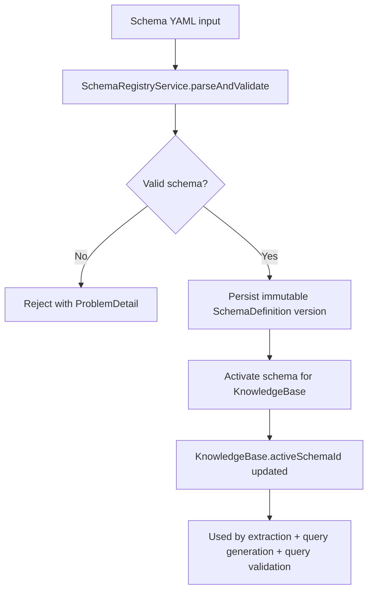
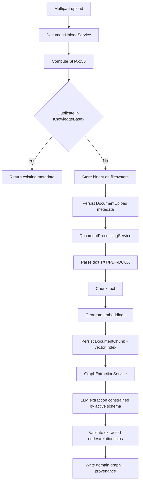
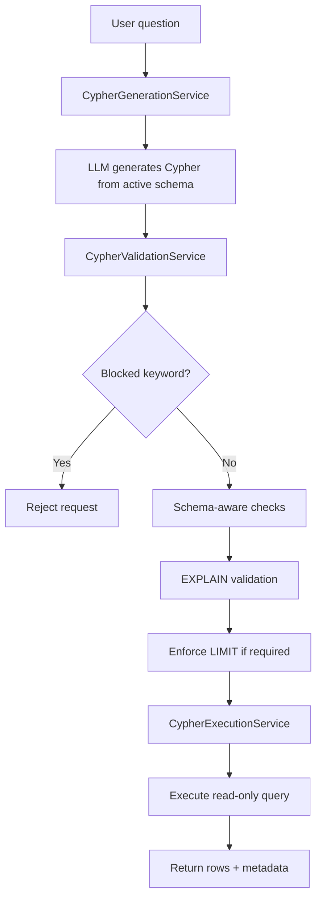

# GraphRAG

GraphRAG is a Java 25 + Spring Boot 4 REST API for:

- schema-managed knowledge bases in Neo4j,
- document upload and local binary storage,
- document parsing/chunking/embedding,
- graph extraction from chunks using an LLM constrained by an active schema,
- Cypher generation, validation, and execution for Q&A.

The project is intentionally API-first, synchronous, and focused on deterministic validation/safety around model-produced outputs.

## Goal and Scope

GraphRAG supports two schema strategies:

- predefined domain schemas (bootstrapped from YAML files),
- runtime-created schemas (validated YAML persisted in Neo4j).

For uploaded documents, the system stores:

- upload metadata (`filename`, `size`, `contentType`, `sha256`, `contentUri`, timestamps, status),
- chunk vectors (embeddings on `DocumentChunk` nodes),
- extracted domain graph nodes/relationships with provenance.

Out of scope (current implementation):

- authentication and authorization,
- asynchronous/background processing orchestration.

## Implemented Scope (Phases 1-8)

- Spring Boot 4.0.6 application foundation with validated config and test coverage.
- Schema registry:
  - YAML schema parsing/validation,
  - immutable versioning,
  - Neo4j persistence,
  - activation per knowledge base.
- Document ingestion:
  - multipart upload,
  - SHA-256 deduplication within a knowledge base,
  - local filesystem binary storage,
  - metadata persistence in Neo4j.
- Processing pipeline:
  - parse document text (TXT/PDF/DOCX),
  - chunk text,
  - generate embeddings,
  - persist `DocumentChunk` nodes + vector index,
  - LLM graph extraction + schema validation + graph write.
- Query pipeline:
  - LLM prompt-to-Cypher generation,
  - read-only and schema-aware Cypher validation (`EXPLAIN`),
  - blocked keyword checks,
  - optional `LIMIT` injection,
  - execution endpoint,
  - combined `/ask` endpoint.
- Error handling via RFC 7807-style `ProblemDetail`.
- Unit + integration tests (including Testcontainers for Neo4j).

## Main Architecture

Package layout:

```text
io.github.vfedoriv.graphrag
  config
  controller
  service
  repository
  domain
  dto
  schema
  document
  embedding
  graph
  query
  llm
  storage
  error
```

Primary runtime services:

- `SchemaRegistryService`: parse/validate/store/activate schemas.
- `DocumentUploadService`: upload metadata + binary storage + dedup.
- `DocumentProcessingService`: parse -> chunk -> embed -> extract graph.
- `GraphExtractionService`: LLM extraction + validation + write orchestration.
- `CypherGenerationService`: prompt-to-Cypher using active schema.
- `CypherValidationService`: blocked keyword checks, schema checks, `EXPLAIN`, limit enforcement.
- `CypherExecutionService`: executes only validated Cypher.

## Process Flows

### Schema lifecycle



### Document ingestion and processing



### Q&A (`/ask`) execution flow



## Tech Stack

- Java 25
- Spring Boot 4.0.6
- Spring Data Neo4j
- Spring AI 2.0.0-M5 (OpenAI-compatible chat + embeddings)
- LangChain4j Tika parser integration
- Neo4j 5.26.25
- Maven + JUnit + Testcontainers

## Data Model

Infrastructure nodes:

- `(:KnowledgeBase {id, name, activeSchemaId, createdAt})`
- `(:SchemaDefinition {id, name, version, sourceType, format, content, contentHash, status, createdAt})`
- `(:DocumentUpload {id, knowledgeBaseId, originalFilename, contentType, sizeBytes, sha256, contentUri, status, uploadedAt, processedAt, errorMessage})`
- `(:DocumentChunk {id, documentId, chunkIndex, text, tokenEstimate, embedding, metadata})`
- `(:ExtractionRun {id, documentId, schemaId, model, status, startedAt, completedAt, errorMessage})`

Infrastructure relationships:

- `(:KnowledgeBase)-[:USES_SCHEMA]->(:SchemaDefinition)`
- `(:DocumentUpload)-[:HAS_CHUNK]->(:DocumentChunk)`
- `(:DocumentUpload)-[:HAS_EXTRACTION_RUN]->(:ExtractionRun)`

Domain-specific nodes/relationships are dynamic and schema-driven. Extracted graph elements are written with provenance properties:

- `id`
- `sourceDocumentId`
- `sourceChunkIds`
- `schemaId`
- `extractionRunId`
- `confidence`
- `createdAt`

## Runtime Profiles

### Default profile

- AI model autoconfiguration is disabled.
- App can boot without model credentials.
- Endpoints that require embedding/chat models will fail at runtime if invoked.

### `openai` profile

- Enables Spring AI OpenAI-compatible auto-config.
- Uses:
  - `app.model.base-url=https://api.openai.com/v1`
  - `app.model.embedding-model=text-embedding-3-small`
  - `app.model.chat-model=gpt-5-mini`
  - `OPENAI_API_KEY`

### `lm_studio` profile

- Enables Spring AI OpenAI-compatible auto-config.
- Uses:
  - `app.model.base-url=http://10.235.1.241:1234/v1`
  - `app.model.embedding-model=nomic-ai/nomic-embed-text-v1.5`
  - `app.model.embedding-dimensions=768`
  - `app.model.chat-model=qwen/qwen3.6-35b-a3b`
  - `LM_STUDIO_API_KEY` (default: `lm-studio`)

## OpenAPI / Swagger

After starting the application, API documentation and interactive request execution are available at:

- Swagger UI: `/swagger-ui/index.html`
- OpenAPI JSON: `/v3/api-docs`

## Configuration

Main app config is in `src/main/resources/application.properties`; profile overrides are in:

- `src/main/resources/application-openai.properties`
- `src/main/resources/application-lm_studio.properties`

Key app properties:

- Neo4j:
  - `spring.neo4j.uri=bolt://localhost:7687`
  - `spring.neo4j.authentication.username=neo4j`
  - `spring.neo4j.authentication.password=notverysecret`
  - `app.neo4j.database=neo4j`
- Storage:
  - `app.storage.documents-root=./var/documents`
- Chunking:
  - `app.chunking.max-tokens=800`
  - `app.chunking.overlap-tokens=80`
  - `app.chunking.max-characters=4000`
- Query safety:
  - `app.query.max-rows=200`
  - `app.query.timeout-seconds=15`
  - `app.query.require-limit=true`
  - `app.query.blocked-keywords=CREATE,MERGE,SET,DELETE,DETACH,REMOVE,DROP,LOAD CSV,CALL`
- Extraction:
  - `app.extraction.max-entities-per-chunk=40`
  - `app.extraction.max-relationships-per-chunk=80`
  - `app.extraction.max-retries=2`

## Schema Format

Schemas are authored in YAML, parsed to Java records, validated, then stored as immutable versions in Neo4j.

Example:

```yaml
name: legal-contracts
version: 1
description: Schema for contract analysis
nodes:
  - label: Contract
    key: contractId
    properties:
      - name: contractId
        type: string
        required: true
      - name: title
        type: string
relationships:
  - type: HAS_PARTY
    from: Contract
    to: Party
indexes:
  - label: Contract
    properties: [contractId]
    unique: true
vectorIndexes:
  - name: document_chunk_embedding
    label: DocumentChunk
    property: embedding
    dimensions: 1536
    similarity: cosine
```

Schema rules:

- schema version is immutable (`name + version` cannot be overwritten),
- generated/runtime schemas must pass validation before use,
- query generation/validation is restricted to active schema labels/types/properties.

## Local Run

1. Start Neo4j:

```bash
docker compose up -d
```

2. Run the app (default profile):

```bash
./mvnw spring-boot:run
```

3. Or run with an AI-enabled profile:

```bash
OPENAI_API_KEY=... ./mvnw spring-boot:run -Dspring-boot.run.profiles=openai
```

```bash
LM_STUDIO_API_KEY=lm-studio ./mvnw spring-boot:run -Dspring-boot.run.profiles=lm_studio
```

4. Health check:

```bash
curl http://localhost:8080/actuator/health
```

## Schema Bootstrap

On startup, predefined schemas from `src/main/resources/schemas/*.yaml` are loaded into Neo4j (idempotent by schema name+version).

## REST API

Base path: `/api/v1`

### Schemas

- `POST /schemas`
- `GET /schemas`
- `GET /schemas/{schemaId}`
- `POST /schemas/validate`
- `POST /knowledge-bases/{knowledgeBaseId}/schemas/{schemaId}/activate`

### Documents

- `POST /knowledge-bases/{knowledgeBaseId}/documents` (multipart form, part name: `file`)
- `POST /documents/{documentId}/process`
- `GET /documents/{documentId}/chunks`

### Queries

- `POST /knowledge-bases/{knowledgeBaseId}/queries/generate`
- `POST /knowledge-bases/{knowledgeBaseId}/queries/validate`
- `POST /knowledge-bases/{knowledgeBaseId}/queries/execute`
- `POST /knowledge-bases/{knowledgeBaseId}/queries/ask`

## Request Contracts (Core)

- `POST /schemas`
  - body: `{"content":"<yaml>", "sourceType":"PREDEFINED|GENERATED"}`
- `POST /schemas/validate`
  - body: `{"content":"<yaml>"}`
- `POST /knowledge-bases/{knowledgeBaseId}/documents`
  - multipart: part `file`
- `POST /knowledge-bases/{knowledgeBaseId}/queries/generate`
  - body: `{"prompt":"..."}`
- `POST /knowledge-bases/{knowledgeBaseId}/queries/validate`
  - body: `{"cypher":"...", "parameters":{...}}`
- `POST /knowledge-bases/{knowledgeBaseId}/queries/execute`
  - body: `{"cypher":"...", "parameters":{...}}`
- `POST /knowledge-bases/{knowledgeBaseId}/queries/ask`
  - body: `{"prompt":"..."}`

## Minimal End-to-End Flow

1. List bootstrapped schemas:

```bash
curl http://localhost:8080/api/v1/schemas
```

2. Activate schema for a knowledge base (creates KB lazily if missing):

```bash
curl -X POST http://localhost:8080/api/v1/knowledge-bases/kb-demo/schemas/<schemaId>/activate
```

3. Upload document:

```bash
curl -X POST "http://localhost:8080/api/v1/knowledge-bases/kb-demo/documents" \
  -F "file=@/absolute/path/to/document.pdf"
```

4. Process document:

```bash
curl -X POST http://localhost:8080/api/v1/documents/<documentId>/process
```

5. Ask question:

```bash
curl -X POST "http://localhost:8080/api/v1/knowledge-bases/kb-demo/queries/ask" \
  -H "Content-Type: application/json" \
  -d '{"prompt":"What obligations does the supplier have?"}'
```

## Processing Flow

Document ingestion:

1. Upload document metadata + binary content.
2. Deduplicate by SHA-256 within knowledge base.
3. Parse text (TXT/PDF/DOCX).
4. Chunk text.
5. Generate embeddings.
6. Persist chunks + ensure Neo4j vector index.
7. Run schema-constrained graph extraction.
8. Validate extracted graph payload.
9. Upsert extracted graph with provenance.
10. Final document status: `COMPLETED` or `FAILED`.

Query flow:

1. Generate Cypher from prompt and active schema.
2. Validate read-only + schema references + syntax (`EXPLAIN`).
3. Inject `LIMIT` when required and missing.
4. Execute only if validation passed.

## Query Safety Model

- Generated/manual Cypher is validated before execution.
- Rejects blocked mutating/procedural keywords.
- Validates labels/relationship types/properties against active schema.
- Runs Neo4j `EXPLAIN` for syntax/planner validation.
- Injects `LIMIT $__limit` when enabled and missing.

## Error Model

Errors are returned as `application/problem+json` (`ProblemDetail`) with status-specific details and optional `errors` payload.

Common status patterns:

- `400` validation/schema/query rejection,
- `404` missing schema/knowledge-base/document,
- `409` immutable schema version conflict,
- `500` unexpected server error.

## Testing

Run all tests:

```bash
./mvnw test
```

Includes:

- unit tests for services, validation, parsers, routing, and DTO validation,
- integration tests with Testcontainers Neo4j,
- end-to-end MVP flow tests with deterministic test doubles for model-dependent paths.

Docker Compose smoke test:

```bash
docker compose up -d neo4j
./mvnw test
docker compose down -v
```

Optional focused E2E test:

```bash
./mvnw -Dtest=EndToEndMvpFlowIntegrationTest test
```

## Notes and Constraints

- Authentication/authorization is intentionally out of scope.
- Document processing is synchronous.
- Duplicate uploads are deduplicated by SHA-256 within a single knowledge base.
- Local filesystem is the current binary storage backend; it is swappable behind `BinaryStorageService`.

## Design Decisions

- Keep infrastructure labels explicit in code; keep domain graph schema external and versioned.
- Use YAML for authoring and Java validation for runtime safety.
- Use Neo4j for both graph and vector data in MVP.
- Keep all model interactions behind interfaces for deterministic tests and provider portability.
- Validate all model-generated data before graph write or query execution.

## Production Readiness Checklist

Security and access:

- Replace local/default credentials (`neo4j/notverysecret`) and rotate secrets regularly.
- Provide model API keys via secret manager or environment injection, never in VCS.
- Add authentication/authorization for all `/api/v1/**` endpoints (currently out of scope).
- Restrict Neo4j network exposure (private network, firewall rules, no public bolt/http by default).
- Enable TLS for client -> API and API -> Neo4j/model-provider traffic.

Data and storage:

- Move binary storage from local filesystem to durable object storage (S3/MinIO/GCS/Azure Blob).
- Define retention policy for raw documents, chunks, extraction runs, and query logs.
- Configure Neo4j backup/restore procedures and regularly verify restore drills.
- Plan schema migration/version activation workflow for production knowledge bases.

Reliability and performance:

- Convert synchronous processing to async jobs with retries and dead-letter handling for large documents.
- Add request size limits, upload type allowlists, and backpressure controls.
- Tune chunking, embedding dimensions, and query row/time limits per environment.
- Load test core flows: upload/process, `/queries/ask`, and concurrent read queries.

Observability and operations:

- Add structured logging with correlation/request IDs across ingestion and query flows.
- Export metrics (latency, error rate, queue depth, token/model usage, Neo4j query timings).
- Add tracing spans for parse/chunk/embed/extract/validate/execute stages.
- Define SLOs and alerting for API availability, processing failures, and Neo4j health.
- Keep runbooks for incident response: model outage, Neo4j outage, storage outage, and rollback.

Compliance and governance:

- Define PII/data-classification policy for uploaded documents and extracted graph content.
- Add audit trails for schema activation and query execution.
- Review prompt/data handling policy for third-party model providers.

## Reference Links

- Spring Boot 4.0.6 docs: https://docs.spring.io/spring-boot/4.0.6/reference/
- Spring Data Neo4j: https://docs.spring.io/spring-boot/4.0.6/reference/data/nosql.html#data.nosql.neo4j
- Spring AI OpenAI chat: https://docs.spring.io/spring-ai/reference/api/chat/openai-chat.html
- Spring AI Neo4j vector store: https://docs.spring.io/spring-ai/reference/api/vectordbs/neo4j.html
- LangChain4j docs: https://docs.langchain4j.dev/
- Testcontainers Neo4j: https://java.testcontainers.org/modules/databases/neo4j/
