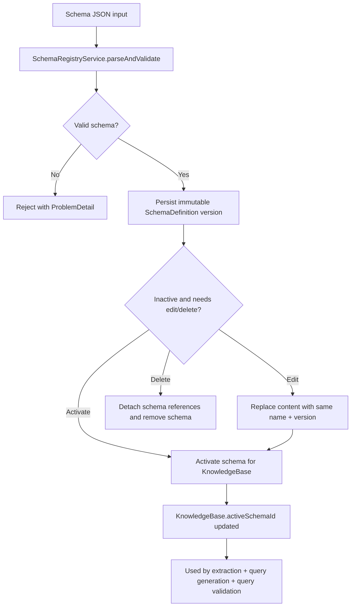
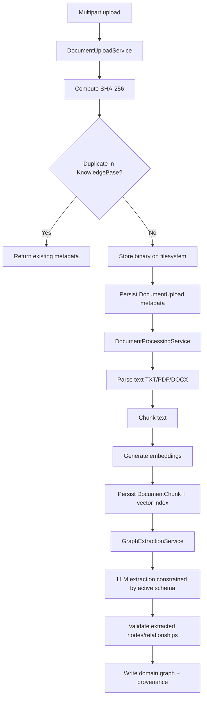
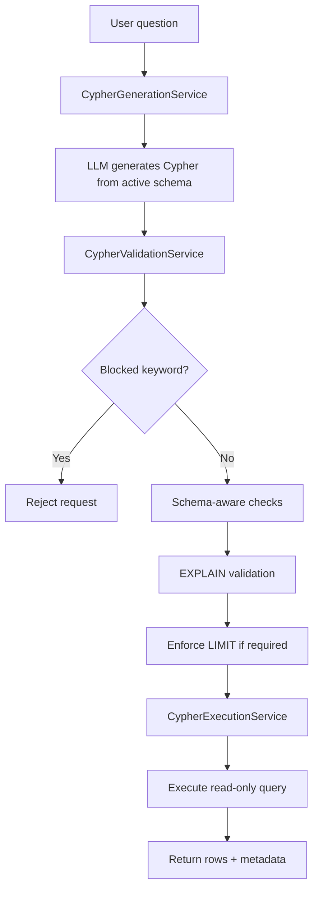

# GraphRAG

GraphRAG is a Java 25 + Spring Boot 4 REST API for:

- schema-managed knowledge bases backed by PostgreSQL,
- document upload and local binary storage,
- document parsing/chunking/embedding,
- graph extraction from chunks using an LLM constrained by an active schema,
- Cypher generation, validation, and execution for Q&A.

The project is intentionally API-first, synchronous, and focused on deterministic validation/safety around model-produced outputs.

## Goal and Scope

GraphRAG supports two schema strategies:

- predefined domain schemas (bootstrapped from JSON files),
- runtime-created schemas (validated JSON persisted in PostgreSQL).

For uploaded documents, the system stores:

- upload metadata (`filename`, `size`, `contentType`, `sha256`, `contentUri`, timestamps, status),
- chunk vectors (embeddings on `DocumentChunk` nodes),
- extracted domain graph nodes/relationships with provenance.

Out of scope (current implementation):

- authentication and authorization,
- asynchronous/background processing orchestration.

## Implemented Scope

- Spring Boot 4.1.0 application foundation with validated config and test coverage.
- Schema registry:
  - JSON schema parsing/validation,
  - immutable versioning,
  - guarded inactive-schema content replacement and deletion,
  - PostgreSQL persistence,
  - activation per knowledge base,
  - schema generation from free text and uploaded files (optional save to registry).
  - review-only multi-source schema discovery from owned documents, pasted text, and request-scoped files, with structured guidance, evidence, support counts, conflicts, and partial source outcomes.
- Document ingestion:
  - multipart upload,
  - upload size limit: 100 MB,
  - SHA-256 deduplication within a knowledge base,
  - local filesystem binary storage,
  - metadata persistence in PostgreSQL,
  - list documents by knowledge base,
  - replace/delete documents with cleanup of chunks, extraction runs, graph relationships, and obsolete extracted nodes.
- Processing pipeline:
  - parse document text (TXT/PDF/DOCX),
  - chunk text,
  - generate embeddings,
  - persist `DocumentChunk` nodes + vector index,
  - LLM graph extraction + schema validation + graph write.
- Query pipeline:
  - LLM prompt-to-Cypher generation,
  - read-only and schema-aware Cypher validation (`EXPLAIN`),
  - blocked keyword checks,
  - optional `LIMIT` injection,
  - embedding-based chunk retrieval with bounded graph context,
  - execution endpoint,
  - combined `/ask` endpoint.
- Runtime AI configuration:
  - PostgreSQL-persisted runtime setting overrides for allowlisted query, hybrid search, chunking, extraction, and AI observability settings,
  - PostgreSQL-persisted OpenAI-compatible AI profiles with write-only API keys,
  - default AI profile seeding from `app.model.*`,
  - per-knowledge-base active AI profile selection with embedding compatibility checks.
- Error handling via RFC 7807-style `ProblemDetail`.
- Unit + integration tests (including Testcontainers for Neo4j and PostgreSQL).

## Main Architecture

Package layout:

```text
io.github.vfedoriv.graphrag
  config
  controller
  service
  repository
  domain
  dto
  schema
  document
  embedding
  graph
  query
  llm
  storage
  error
```

Primary runtime services:

- `SchemaRegistryService`: parse/validate/store/activate schemas, with guarded inactive-schema update/delete.
- `SchemaDraftEvaluationService`: durable held-out dry extraction and deterministic draft quality metrics.
- `SchemaDraftPublicationService`: revision-specific readiness and atomic publication of inactive generated schemas.
- `SchemaReprocessingPlanService`: bounded post-activation orchestration over existing overwrite processing.
- `SchemaDiscoveryService`: bounded multi-source analysis using the knowledge-base AI profile, deterministic candidate aggregation, and review-only schema projection.
- `DocumentUploadService`: upload metadata + binary storage + dedup, plus replace/delete cleanup.
- `DocumentProcessingService`: parse -> chunk -> embed -> extract graph.
- `GraphExtractionService`: LLM extraction + validation + write orchestration.
- `CypherGenerationService`: prompt-to-Cypher using active schema.
- `CypherValidationService`: blocked keyword checks, schema checks, `EXPLAIN`, limit enforcement.
- `CypherExecutionService`: executes only validated Cypher with the effective runtime row and timeout policy.
- `RuntimeSettingsService`: allowlisted runtime setting overrides, restart lifecycle metadata, live logging control, and typed live accessors.
- `AiProfileService`: OpenAI-compatible profile CRUD, default profile seeding, API-key masking, and cache invalidation.

## Process Flows

### Schema lifecycle



### Document ingestion and processing



### Schema draft held-out evaluation

Discovery evidence and held-out evaluation content are separated by exact binary SHA-256 identity. A knowledge-base
document is ineligible when its hash matches a successful `DOCUMENT`, draft-owned `FILE`, or pasted `TEXT` result in
the analysis run that produced the draft's current aggregate. Different encodings or file packaging are not treated as
matches. Normal document upload and processing do not change draft revisions or aggregates unless the document is
explicitly added as a draft source.

The evaluation-eligible document response exposes draft-wide `readiness` and `blockingReason` fields in addition to
the existing page metadata. `NOT_READY` with `DRAFT_ANALYSIS_REQUIRED` makes every returned document non-selectable;
run draft analysis again before starting evaluation. `ACTIVE_DISCOVERY_EVIDENCE` identifies documents whose content
contributed to the current aggregate.

### Q&A (`/ask`) execution flow



## Tech Stack

- Java 25
- Spring Boot 4.1.0
- Spring Data Neo4j
- Spring Data JPA + Flyway
- Spring AI 2.0.0 (OpenAI-compatible chat + embeddings)
- LangChain4j 1.16.2 Tika parser integration
- Neo4j 5.26.25
- PostgreSQL 17
- Maven + JUnit + Testcontainers

## Data Model

PostgreSQL is authoritative for every operational aggregate: AI profiles, runtime
settings, knowledge bases, schemas, documents, processing/extraction runs, schema
draft analysis/evaluation, publication, storage mutations, and reprocessing plans.
Flyway manages these tables in the `graphrag.app` schema.

Neo4j is graph-only storage. It contains `DocumentChunk` embeddings,
schema-defined facts, extraction evidence, provenance, direct knowledge-base and
document scope properties, and graph-native relationships. It does not contain
operational knowledge-base, schema, document, run, profile, setting, draft,
publication, or reprocessing nodes/relationships.

Domain-specific nodes/relationships are dynamic and schema-driven. Extracted graph elements are written with provenance properties:

- `id`
- `sourceDocumentId`
- `sourceChunkIds`
- `schemaId`
- `extractionRunId`
- `confidence`
- `createdAt`

## Runtime Profiles

### Default profile

- AI model autoconfiguration is disabled.
- App can boot without model credentials.
- Endpoints that require embedding/chat models will fail at runtime if invoked.

### `openai` profile

- Enables Spring AI OpenAI-compatible auto-config.
- Uses:
  - `app.model.base-url=https://api.openai.com/v1`
  - `app.model.embedding-model=text-embedding-3-small`
  - `app.model.chat-model=gpt-5-mini`
  - `OPENAI_API_KEY`

### `lm_studio` profile

- Enables Spring AI OpenAI-compatible auto-config.
- Uses:
  - `app.model.base-url=http://10.235.1.241:1234/v1`
  - `app.model.embedding-model=nomic-ai/nomic-embed-text-v1.5`
  - `app.model.embedding-dimensions=768`
  - `app.model.chat-model=qwen/qwen3.6-35b-a3b`
  - `LM_STUDIO_API_KEY` (default: `lm-studio`)

## Runtime Settings And AI Profiles

On startup, the application seeds a default AI profile from `app.model.*` when no default exists. New knowledge bases are assigned that default profile. Profile API keys are write-only: create/update requests may supply or clear the secret, but read responses expose only configured/masked metadata. Profiles may also set a non-secret `tokenizerId`; `cl100k_base` is the supported explicit value. If it is omitted, `text-embedding-ada-002`, `text-embedding-3-small`, and `text-embedding-3-large` resolve to `cl100k_base`, while unknown models use the conservative, versioned `utf8-byte-v1` estimator.

Runtime profile selection is knowledge-base scoped. Document processing, graph extraction, Cypher generation, `/ask`, hybrid search, knowledge-base-scoped schema generation, and multi-source schema discovery resolve the active AI profile and create Spring AI OpenAI-compatible chat/embedding clients at runtime. Runtime clients are cached by profile id and revision, then invalidated after profile changes.

Persisted runtime settings override selected startup properties. `mutable=true` means the settings API accepts validated updates or clears; `liveApplied` and `updateMode` describe when the value affects the running process. Live mutable settings cover query limits and validation, hybrid search bounds, chunking limits, extraction limits/retries, schema-discovery source/size/chunk/concurrency/timeout limits, AI observability privacy/tag settings, and `logging.level.root`, which is applied through Spring Boot logging. Chunking updates are validated atomically and apply only to subsequent processing; existing chunks and in-flight attempts retain their snapshotted revisions. Selected non-secret restart-required settings, such as the document storage root, can be saved as desired values for the next backend restart.

The active default remains `fixed-character`. Each processing attempt snapshots the strategy and strategy revision, canonical settings hash, tokenizer/estimator identity and revision, exact-versus-conservative count mode, and effective chunker revision. New chunks also retain this provenance plus reliable source offsets. Exact `cl100k_base` counting is implemented through a project-owned adapter over JTokkit; LangChain4j provider types do not leak into application or persistence contracts.

An AI profile request may select an explicit tokenizer for an embedding-model alias:

```json
{
  "id": "openai-alias",
  "name": "OpenAI embedding alias",
  "baseUrl": "https://api.openai.com/v1",
  "chatModel": "gpt-5-mini",
  "embeddingModel": "company-embedding-alias",
  "tokenizerId": "cl100k_base",
  "embeddingDimensions": 1536
}
```

Profile reads return both `tokenizerId` (nullable configured value) and `resolvedTokenizerId`; they never return the raw API key. Once embedded chunks exist, profile assignment or mutation is rejected if the resolved tokenizer identity would change, just as it is for provider/model/dimension incompatibility.

The runtime settings list exposes `currentValue`, `defaultValue`, `activeValue`, `source`, and `lifecycleState`. Restart-required overrides report `pending-restart` while the saved desired value differs from the startup-active value and `active` after restart when the running default matches the persisted override. Profile-specific property files are resolved before the catalog is built, so listed defaults reflect active Spring profiles.

Startup-bound settings consumed before PostgreSQL-backed overrides can load remain deployment-managed unless the implementation provides a safe runtime reassignment path. PostgreSQL and Neo4j connectivity, credentials, database/schema selection, and pool metadata are not editable through `/api/v1/runtime-settings`; change them through environment variables, Docker Compose, Kubernetes, or equivalent deployment configuration. AI provider defaults under `app.model.*` and derived `spring.ai.openai.*` entries are visible as profile-managed context, but knowledge-base provider behavior must be changed through the AI profile API. API keys, datasource/Neo4j passwords, and OTLP authorization headers are masked in runtime settings responses and never expose raw secret values.

## OpenAPI / Swagger

After starting the application, API documentation and interactive request execution are available at:

- Swagger UI: `/swagger-ui/index.html`
- OpenAPI JSON: `/v3/api-docs`

## Configuration

Main app config is in `src/main/resources/application.properties`; profile overrides are in:

- `src/main/resources/application-openai.properties`
- `src/main/resources/application-lm_studio.properties`
- `src/main/resources/application-langfuse.properties`

Key app properties:

- Neo4j:
  - `spring.neo4j.uri=bolt://localhost:7687`
  - `spring.neo4j.authentication.username=neo4j`
  - `spring.neo4j.authentication.password=notverysecret`
  - `app.neo4j.database=neo4j`
- Storage:
  - `app.storage.documents-root=./var/documents`
- Chunking:
  - `app.chunking.strategy=fixed-character`
  - `app.chunking.target-tokens=800`
  - `app.chunking.hard-character-limit=4000`
  - `app.chunking.overlap-tokens=80`
  - `app.chunking.max-tokens=800` (compatibility alias; canonical `target-tokens` wins)
  - `app.chunking.max-characters=4000` (compatibility alias; canonical `hard-character-limit` wins)
- Query safety:
  - `app.query.max-rows=200`
  - `app.query.timeout-seconds=15`
  - `app.query.require-limit=true`
  - `app.query.blocked-keywords=CREATE,MERGE,SET,DELETE,DETACH,REMOVE,DROP,LOAD CSV,CALL`
  - `app.query.hybrid-search-default-top-k=10`
  - `app.query.hybrid-search-max-top-k=50`
  - `app.query.hybrid-search-candidate-multiplier=4`
  - `app.query.hybrid-search-max-candidates=200`
  - `app.query.hybrid-search-default-graph-depth=1`
  - `app.query.hybrid-search-max-graph-depth=2`
  - `app.query.hybrid-search-include-chunk-text=true`
- Extraction:
  - `app.extraction.max-entities-per-chunk=100`
  - `app.extraction.max-relationships-per-chunk=200`
  - `app.extraction.max-retries=2`
- AI observability:
  - `app.ai.observability.enabled=false`
  - `app.ai.observability.content-capture-enabled=false`
  - `app.ai.observability.input-output-content-enabled=true`
  - `app.ai.observability.max-input-output-length=1048576`
  - `management.tracing.enabled=false`
  - `management.opentelemetry.tracing.export.otlp.endpoint=`

Runtime settings catalog categories:

- Live mutable: `app.query.*`, `app.chunking.*`, `app.extraction.*`, `app.ai.observability.*`, and `logging.level.root`.
- Restart-required mutable: supported non-secret entries such as `app.storage.documents-root`, reported with pending or active lifecycle metadata.
- Read-only or restart-required visibility: `spring.application.name`, Spring AI bootstrap switches, Spring auto-configuration exclusions, PostgreSQL datasource/schema/pool metadata, Neo4j URI/username/database, multipart limits, actuator/health settings, tracing switches, OTLP endpoint and non-secret exporter headers.
- Profile-managed visibility: `app.model.base-url`, model names/dimensions, and derived Spring AI OpenAI base URL/model aliases. Use AI profile management for operational provider changes.
- Sensitive read-only: `app.model.api-key`, `spring.ai.openai.api-key`, `spring.datasource.password`, `spring.neo4j.authentication.password`, and OTLP authorization headers. Responses indicate configured/masked status only.

The query API rejects explicit `LIMIT` values above `app.query.max-rows`, applies `app.query.timeout-seconds` at the transaction boundary, and includes the immutable applied policy snapshot under `validation.policy`.

## Schema Format

Schemas are authored in JSON, parsed to Java records, validated, then stored as immutable versions in PostgreSQL.

Example:

```json
{
  "name": "legal-contracts",
  "version": 1,
  "description": "Schema for contract analysis",
  "nodes": [
    {
      "label": "Contract",
      "key": "contractId",
      "properties": [
        {"name": "contractId", "type": "string", "required": true},
        {"name": "title", "type": "string"}
      ]
    }
  ],
  "relationships": [
    {"type": "HAS_PARTY", "from": "Contract", "to": "Party"}
  ],
  "indexes": [
    {"label": "Contract", "properties": ["contractId"], "unique": true}
  ],
  "vectorIndexes": [
    {
      "name": "document_chunk_embedding",
      "label": "DocumentChunk",
      "property": "embedding",
      "dimensions": 1536,
      "similarity": "cosine"
    }
  ]
}
```

Schema rules:

- schema version is immutable (`name + version` cannot be overwritten),
- inactive schemas can be updated only when replacement JSON keeps the same `name + version`,
- active schemas cannot be updated or deleted,
- generated/runtime schemas must pass validation before use,
- query generation/validation is restricted to active schema labels/types/properties.

## Local Run

1. Start required PostgreSQL and Neo4j services and provision GraphRAG's database:

```bash
docker compose up -d langfuse-postgres neo4j
docker compose exec -T langfuse-postgres \
  bash /docker-entrypoint-initdb.d/20-init-graphrag.sh
```

The Langfuse PostgreSQL service is labeled `org.springframework.boot.ignore: true`
so Spring Boot Compose support cannot replace GraphRAG's explicit
`GRAPHRAG_POSTGRES_*` datasource. The local defaults use database `graphrag`, role
`graphrag`, and schema `app`—the effective identity is
`graphrag / graphrag / app`.

2. Run the app (default profile):

```bash
./mvnw spring-boot:run
```

3. Or run with an AI-enabled profile:

```bash
OPENAI_API_KEY=... ./mvnw spring-boot:run -Dspring-boot.run.profiles=openai
```

```bash
LM_STUDIO_API_KEY=lm-studio ./mvnw spring-boot:run -Dspring-boot.run.profiles=lm_studio
```

4. Health check:

```bash
curl http://localhost:8080/actuator/health
```

## AI Observability

The application includes optional AI observability for model-facing workflows:

- OpenTelemetry traces for document processing, schema generation, graph extraction, embeddings, and Cypher generation.
- Micrometer metrics for model calls, failures, latency, and token usage when provider metadata exposes token counts.
- Prompt, chunk, query, and response content capture is disabled by default.

Default startup does not require Langfuse or an OTLP endpoint.

### Local Langfuse

Start Neo4j plus the local Langfuse stack:

```bash
docker compose --profile langfuse up -d
```

The `langfuse` profile starts Langfuse web/worker, Postgres, ClickHouse, Redis,
and pinned Garage `v2.3.0` object storage. Garage uses separate persistent
metadata and object-data volumes and an idempotent initializer; Langfuse does
not start until Garage is healthy and its `langfuse` bucket and scoped key are
ready. Without the profile, Garage and the other profile-gated services remain
stopped.

The local Garage S3 API is published at `http://localhost:9090`. Langfuse event
traffic uses the internal Compose endpoint, while presigned media URLs use the
host-reachable endpoint controlled by `LANGFUSE_GARAGE_MEDIA_ENDPOINT`. Garage
region, credentials, RPC/admin secrets, zone, and logical capacity can be
overridden with `LANGFUSE_GARAGE_*` variables. Repository defaults are for
local development only.

Local Langfuse UI:

- URL: `http://localhost:3000`
- Login: `dev@example.local`
- Password: `langfuse-local-password`
- Project public key: `pk-lf-local-dev`
- Project secret key: `sk-lf-local-dev`
- Spring Boot OTLP HTTP traces endpoint: `http://localhost:3000/api/public/otel/v1/traces`

These credentials are auto-created from Compose environment variables and are local-development defaults only. Do not reuse them in shared or production environments.

Verify Garage initialization, bucket authorization, object operations, and
persistence across container recreation:

```bash
./scripts/garage-smoke-test.sh
```

Back up both `langfuse_garage_meta` and `langfuse_garage_data` consistently,
and regularly verify that the pair can be restored before relying on those
backups.

Run the app with Langfuse tracing enabled:

```bash
OPENAI_API_KEY=... ./mvnw spring-boot:run -Dspring-boot.run.profiles=openai,langfuse
```

For LM Studio:

```bash
LM_STUDIO_API_KEY=lm-studio ./mvnw spring-boot:run -Dspring-boot.run.profiles=lm_studio,langfuse
```

After processing a document or running a query generation flow, open Langfuse and inspect the `GraphRAG Local` project traces. Local model metrics are available through Actuator, for example:

```bash
curl http://localhost:8080/actuator/metrics/graphrag.ai.model.calls
curl http://localhost:8080/actuator/metrics/graphrag.ai.model.latency
curl http://localhost:8080/actuator/metrics/graphrag.ai.model.tokens
```

Verified local trace smoke test:

```bash
docker compose --profile langfuse up -d

curl -u pk-lf-local-dev:sk-lf-local-dev \
  http://localhost:3000/api/public/projects

OPENAI_API_KEY=... ./mvnw spring-boot:run -Dspring-boot.run.profiles=openai,langfuse

curl -X POST http://localhost:8080/api/v1/schemas/generate/example \
  -H 'Content-Type: application/json' \
  -d '{"text":"Acme signed contract C-101 with Beta Corp.","userPrompt":"Use Party and Contract entities."}'

FROM_TIMESTAMP="$(date -u -d '10 minutes ago' +%Y-%m-%dT%H:%M:%SZ)"
curl -u pk-lf-local-dev:sk-lf-local-dev \
  "http://localhost:3000/api/public/traces?fromTimestamp=${FROM_TIMESTAMP}&limit=10"
```

The trace response should include an HTTP parent trace with observations such as `graphrag.ai.model` and `chat <model>`. The AI span includes stable attributes like `ai.workflow`, `ai.operation`, `ai.provider.profile`, `ai.model.name`, `ai.status`, and `ai.content_capture`; the Spring AI generation observation includes token usage when the provider returns it.

After Garage cutover, also upload and download a media attachment from the
Langfuse UI. Inspect the presigned request in browser developer tools and
confirm it uses the host-reachable `localhost:9090` endpoint rather than the
Compose-only `langfuse-garage` hostname.

### Content Capture

By default, Langfuse trace Input/Output fields include full prompt and model response content, capped by `app.ai.observability.max-input-output-length`. This makes local trace debugging useful without relying on preview-only metadata.

To disable full Input/Output capture and export only sanitized previews plus length/hash metadata:

```bash
-Dapp.ai.observability.input-output-content-enabled=false
```

Generic high-cardinality trace attributes still include sanitized lengths, previews, hashes, workflow names, status, model/provider metadata, and result counts by default. To also export separate full `*.content` metadata attributes for local debugging:

```bash
-Dapp.ai.observability.content-capture-enabled=true
```

Do not enable full content capture or full Input/Output export for shared or production environments unless data handling and retention policies allow prompt/document content to be stored in the trace backend.

### Operational Logging

Application logs are metadata-first and independent from AI trace content capture. Normal log levels record workflow and entity identifiers, lengths, counts, timings, statuses, exception classes, and short non-reversible fingerprints where correlation is useful. They do not record document text, prompts, queries, model responses, generated schemas, or extracted graph payloads.

The central `AiObservationService` is the only application-owned path that can attach controlled AI input/output content to observations. Its capture settings and length limits apply to trace attributes; enabling trace capture does not make application logs content-bearing. No local content diagnostic mode is enabled by default or implicitly through a normal logging level.

Tests use `src/test/resources/logback-test.xml` to keep application warnings/errors visible while reducing routine Spring, Testcontainers, Neo4j, and payload noise. When diagnosing a failure, use the correlation identifiers and metadata in application logs, then inspect the opt-in trace backend according to its retention policy.

## Schema Bootstrap

On startup, predefined schemas from `src/main/resources/schemas/*.json` are loaded into PostgreSQL (idempotent by schema name+version).

## REST API

Base path: `/api/v1`

### Schemas

- `POST /schemas`
- `POST /schemas/generate`
- `POST /schemas/generate/from-file` (multipart form, part name: `file`)
- `POST /schemas/generate/example`
- `POST /schemas/generate/example/from-file` (multipart form, part name: `file`)
- `POST /knowledge-bases/{knowledgeBaseId}/schemas/discover` (owned document IDs and pasted-text sources)
- `POST /knowledge-bases/{knowledgeBaseId}/schemas/discover/from-files` (multipart `request` metadata plus repeated `files` parts)
- `GET /schemas`
- `GET /knowledge-bases/{knowledgeBaseId}/schemas`
- `GET /schemas/{schemaId}`
- `PUT /schemas/{schemaId}`
- `DELETE /schemas/{schemaId}`
- `POST /schemas/validate`
- `POST /knowledge-bases/{knowledgeBaseId}/schemas/{schemaId}/activate`

`knowledgeBaseId` is a client-defined identifier (not server-generated).  
When you call `POST /knowledge-bases/{knowledgeBaseId}/schemas/{schemaId}/activate`, the service marks the schema as active for that knowledge base; if the knowledge base does not exist yet, it is created lazily.

### Knowledge Bases

- `POST /knowledge-bases`
- `GET /knowledge-bases`
- `GET /knowledge-bases/{knowledgeBaseId}`
- `PUT /knowledge-bases/{knowledgeBaseId}`
- `DELETE /knowledge-bases/{knowledgeBaseId}`

### Documents

- `POST /knowledge-bases/{knowledgeBaseId}/documents` (multipart form, part name: `file`)
- `GET /knowledge-bases/{knowledgeBaseId}/documents`
- `PUT /knowledge-bases/{knowledgeBaseId}/documents/{documentId}` (multipart form, part name: `file`)
- `DELETE /knowledge-bases/{knowledgeBaseId}/documents/{documentId}`
- `POST /documents/{documentId}/process?allowOverwrite=false|true`
- `GET /documents/{documentId}/chunks`

### Queries

- `POST /knowledge-bases/{knowledgeBaseId}/queries/generate`
- `POST /knowledge-bases/{knowledgeBaseId}/queries/validate`
- `POST /knowledge-bases/{knowledgeBaseId}/queries/execute`
- `POST /knowledge-bases/{knowledgeBaseId}/queries/ask`
- `POST /knowledge-bases/{knowledgeBaseId}/queries/hybrid-search`

## Request Contracts (Core)

- `POST /schemas`
  - body: `{"content":"<json>", "sourceType":"PREDEFINED|GENERATED"}`
- `POST /schemas/generate`
  - body: `{"name":"generated-legal-schema", "version":1, "description":"optional", "text":"<unstructured text>", "example":"optional example json or text"}`
- `POST /schemas/generate/from-file`
  - multipart parts: `request` (JSON: `{"name":"generated-legal-schema","version":1,"description":"optional","example":{...}}`), `file` (PDF/TXT/DOCX)
- `POST /schemas/generate/example`
  - body: `{"text":"<unstructured text>", "userPrompt":"optional guidance"}`
- `POST /schemas/generate/example/from-file`
  - multipart fields: optional `userPrompt` (string), part `file` (PDF/TXT/DOCX)
- `POST /schemas/validate`
  - body: `{"content":"<json>"}`
- `PUT /schemas/{schemaId}`
  - body: `{"content":"<json>", "sourceType":"PREDEFINED|GENERATED"}`
  - replaces content only for inactive schemas and only when the JSON keeps the original `name + version`
- `DELETE /schemas/{schemaId}`
  - returns `409 Conflict` when the schema is active for a knowledge base
- `POST /knowledge-bases`
  - body: `{"id":"kb-demo", "name":"Demo knowledge base"}`
- `PUT /knowledge-bases/{knowledgeBaseId}`
  - body: `{"name":"Updated knowledge base name"}`
- `POST /knowledge-bases/{knowledgeBaseId}/documents`
  - multipart: part `file`
- `GET /knowledge-bases/{knowledgeBaseId}/documents`
  - returns: document metadata list for the knowledge base
- `PUT /knowledge-bases/{knowledgeBaseId}/documents/{documentId}`
  - multipart: part `file`
  - replaces the binary, resets processing status to `UPLOADED`, and removes document-scoped chunks/extraction artifacts
- `DELETE /knowledge-bases/{knowledgeBaseId}/documents/{documentId}`
  - deletes the binary, upload metadata, and document-scoped derived artifacts
- `GET /knowledge-bases/{knowledgeBaseId}/schemas`
  - returns: schema versions associated with the knowledge base
- `POST /documents/{documentId}/process`
  - query param: `allowOverwrite` (optional boolean, default `false`)
  - returns `409 Conflict` when a completed extraction already exists and overwrite is not allowed
- `POST /knowledge-bases/{knowledgeBaseId}/queries/generate`
  - body: `{"prompt":"..."}`
- `POST /knowledge-bases/{knowledgeBaseId}/queries/validate`
  - body: `{"cypher":"...", "parameters":{...}}`
- `POST /knowledge-bases/{knowledgeBaseId}/queries/execute`
  - body: `{"cypher":"...", "parameters":{...}}`
- `POST /knowledge-bases/{knowledgeBaseId}/queries/ask`
  - body: `{"prompt":"..."}`
- `POST /knowledge-bases/{knowledgeBaseId}/queries/hybrid-search`
  - body: `{"query":"pump maintenance","topK":10,"graphDepth":1,"includeChunkText":true}`
  - returns ranked chunk hits with source document metadata and bounded graph context (`entities`, `relationships`)

## Minimal End-to-End Flow

1. List bootstrapped schemas:

```bash
curl http://localhost:8080/api/v1/schemas
```

2. Create a knowledge base:

```bash
curl -X POST "http://localhost:8080/api/v1/knowledge-bases" \
  -H "Content-Type: application/json" \
  -d '{"id":"kb-demo","name":"Demo KB"}'
```

3. Activate schema for the knowledge base:

```bash
curl -X POST http://localhost:8080/api/v1/knowledge-bases/kb-demo/schemas/<schemaId>/activate
```

How `knowledgeBaseId` works:
- Pick any stable string you want to use as your tenant/project KB key (example: `kb-demo`, `acme-contracts-prod`).
- Use that same value in all KB-scoped endpoints (`/documents`, `/queries/*`, schema activation).
- You can create a knowledge base explicitly via `POST /knowledge-bases`; activation also supports lazy creation for backward compatibility.

4. Upload document:

```bash
curl -X POST "http://localhost:8080/api/v1/knowledge-bases/kb-demo/documents" \
  -F "file=@/absolute/path/to/document.pdf"
```

5. Process document:

```bash
curl -X POST http://localhost:8080/api/v1/documents/<documentId>/process
```

If a completed extraction already exists, repeat processing requires explicit overwrite confirmation:

```bash
curl -X POST "http://localhost:8080/api/v1/documents/<documentId>/process?allowOverwrite=true"
```

6. Ask question:

```bash
curl -X POST "http://localhost:8080/api/v1/knowledge-bases/kb-demo/queries/ask" \
  -H "Content-Type: application/json" \
  -d '{"prompt":"What obligations does the supplier have?"}'
```

## Processing Flow

Document ingestion:

1. Upload document metadata + binary content.
2. Deduplicate by SHA-256 within knowledge base.
3. Parse text (TXT/PDF/DOCX).
4. Chunk text.
5. Generate embeddings.
6. Persist chunks + ensure Neo4j vector index.
7. Run schema-constrained graph extraction.
8. Validate extracted graph payload.
9. Upsert extracted graph with provenance.
10. Final document status: `COMPLETED` or `FAILED`.

Query flow:

1. `/queries/generate`, `/queries/validate`, `/queries/execute`, and `/queries/ask` use the active schema to generate and validate read-only Cypher before execution.
2. `/queries/hybrid-search` embeds the query text, searches the existing `document_chunk_embedding` vector index, filters hits to the requested knowledge base, and expands bounded `MENTIONS` graph context.
3. Hybrid search returns evidence-first results ordered by vector score, with optional chunk text and source document metadata.

## Schema Draft Evaluation, Publication, and Reprocessing

Draft evaluation accepts explicitly selected knowledge-base documents that are outside the active discovery evidence set. It snapshots the projection, review decisions, document SHA-256 values, AI profile revision, prompt/contract revisions, and settings. Dry evaluation parses, chunks, extracts, and validates in memory; it does not persist chunks, embeddings, extraction runs, nodes, or relationships.

Contractual metrics use these formulas:

- recognized entity rate = recognized entity observations / (recognized + unknown entity observations),
- dropped relationship rate = schema-rejected relationship observations / all relationship observations,
- key availability rate = recognized node observations containing every configured key / recognized node observations requiring keys.

Property type conflicts and missing required properties are counts. Low-support and guided-without-evidence counts come from the snapshotted aggregate. A zero denominator is returned as `applicable=false` with a `null` value. Intended-question and schema-noise fields are always labeled advisory and retain profile/prompt reproducibility metadata; an advisory failure or unavailable adapter does not remove deterministic metrics.

Publication readiness is revision-specific and returns the canonical projection content hash plus every blocking reason ID. Publishing that exact revision/hash creates and associates one normal `INACTIVE` generated schema. It does not activate the schema and does not process documents. The existing activation API remains an explicit second operation. Published inactive schemas remain editable/deletable under normal registry rules; publication responses preserve the original hash and report drift if later inactive edits change the live content hash.

Reprocessing is an explicit third operation available after the published schema is active. A durable plan snapshots the active schema/hash, AI profile revision, processing options, and document hashes, then invokes existing document processing with overwrite enabled. Items commit independently. Source changes become `STALE_SOURCE`; an active-schema/hash change blocks queued work. Startup recovery marks queued/running evaluation and plan work interrupted and retryable. Retry creates a linked resource, retains matching successes, and requires explicit resnapshotting of unresolved reprocessing items.

## Query Safety Model

- Generated/manual Cypher is validated before execution.
- Rejects blocked mutating/procedural keywords.
- Validates labels/relationship types/properties against active schema.
- Runs Neo4j `EXPLAIN` for syntax/planner validation.
- Injects `LIMIT $__limit` when enabled and missing.

## Error Model

Errors are returned as `application/problem+json` (`ProblemDetail`) with status-specific details and optional `errors` payload.

Common status patterns:

- `400` validation/schema/query rejection,
- `404` missing schema/knowledge-base/document,
- `409` immutable schema identity, active-schema mutation, duplicate document, or overwrite conflict,
- `500` unexpected server error.

## Testing

Run all tests:

```bash
./mvnw test
```

Includes:

- unit tests for services, validation, parsers, routing, and DTO validation,
- integration tests with Testcontainers PostgreSQL and Neo4j,
- end-to-end MVP flow tests with deterministic test doubles for model-dependent paths.

Full test suite (containers are managed by Testcontainers):

```bash
./mvnw test
```

Optional focused E2E test:

```bash
./mvnw test -Dtest=EndToEndMvpFlowIntegrationTest
```

## Notes and Constraints

- Authentication/authorization is intentionally out of scope.
- Document processing is synchronous.
- Duplicate uploads are deduplicated by SHA-256 within a single knowledge base.
- Local filesystem is the current binary storage backend; it is swappable behind `BinaryStorageService`.

## Design Decisions

- Keep infrastructure labels explicit in code; keep domain graph schema external and versioned.
- Use JSON for authoring and Java validation for runtime safety.
- Use PostgreSQL for operational state and Neo4j for graph facts, provenance,
  chunks, and vectors.
- Keep all model interactions behind interfaces for deterministic tests and provider portability.
- Validate all model-generated data before graph write or query execution.

## Production Readiness Checklist

Security and access:

- Replace local/default credentials (`neo4j/notverysecret`) and rotate secrets regularly.
- Provide model API keys via secret manager or environment injection, never in VCS.
- Add authentication/authorization for all `/api/v1/**` endpoints (currently out of scope).
- Restrict Neo4j network exposure (private network, firewall rules, no public bolt/http by default).
- Enable TLS for client -> API and API -> Neo4j/model-provider traffic.

Data and storage:

- Move binary storage from local filesystem to durable object storage (S3-compatible/GCS/Azure Blob).
- Define retention policy for raw documents, chunks, extraction runs, and query logs.
- Configure Neo4j backup/restore procedures and regularly verify restore drills.
- Plan schema migration/version activation workflow for production knowledge bases.

Reliability and performance:

- Convert synchronous processing to async jobs with retries and dead-letter handling for large documents.
- Add request size limits, upload type allowlists, and backpressure controls.
- Tune chunking, embedding dimensions, and query row/time limits per environment.
- Load test core flows: upload/process, `/queries/ask`, and concurrent read queries.

Observability and operations:

- Add structured logging with correlation/request IDs across ingestion and query flows.
- Extend metrics beyond AI model calls to queue depth, Neo4j query timings, and storage operations.
- Tune tracing coverage, sampling, dashboards, and alerts for production SLOs.
- Define SLOs and alerting for API availability, processing failures, and Neo4j health.
- Keep runbooks for incident response: model outage, Neo4j outage, storage outage, and rollback.

Compliance and governance:

- Define PII/data-classification policy for uploaded documents and extracted graph content.
- Add audit trails for schema activation and query execution.
- Review prompt/data handling policy for third-party model providers.

## Reference Links

- Spring Boot 4.1.0 docs: https://docs.spring.io/spring-boot/4.1.0/reference/
- Spring Data Neo4j: https://docs.spring.io/spring-boot/4.1.0/reference/data/nosql.html#data.nosql.neo4j
- Spring AI OpenAI chat: https://docs.spring.io/spring-ai/reference/api/chat/openai-chat.html
- Spring AI Neo4j vector store: https://docs.spring.io/spring-ai/reference/api/vectordbs/neo4j.html
- LangChain4j docs: https://docs.langchain4j.dev/
- Testcontainers Neo4j: https://java.testcontainers.org/modules/databases/neo4j/
