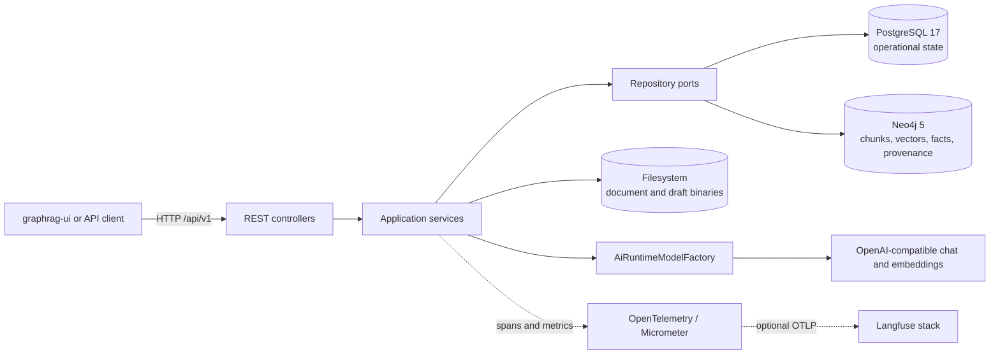

# System architecture

GraphRAG is an API-first Spring Boot application. Thin REST controllers delegate to workflow services, which use repository ports backed by PostgreSQL adapters or graph-only Neo4j adapters. Model-produced graph payloads and Cypher are never trusted without validation.

## Container and service flow

The default profile can boot without model beans. AI-backed services resolve the active knowledge-base profile at operation time and obtain revision-scoped clients from `AiRuntimeModelFactory`.

## Layer boundaries

1. **Controllers and DTOs** own HTTP mapping, validation, response status, and metadata-only request logging.
2. **Services** own lifecycle rules, admission, orchestration, cleanup, and policy snapshots.
3. **Repository ports** express persistence needs without making domain workflows depend on adapter details.
4. **PostgreSQL adapters** persist all operational aggregates in Flyway's `app` schema.
5. **Neo4j adapters/services** persist retrieval chunks and graph-native facts/evidence/provenance only.
6. **Filesystem storage** owns binary bytes; PostgreSQL owns their metadata and state.

Cross-store operations are explicit workflows rather than distributed transactions. Services record durable state, perform bounded work, and apply cleanup/recovery rules when later steps fail.

## Reprocessing execution and recovery boundary

Schemas owns reprocessing plan state, conditional claims, target guards, item
completion, retry decisions, and counter repair. `ReprocessingItemExecution` uses
the schemas-owned `ReprocessingDocumentExecutor` port; recovery uses
`ReprocessingProcessingOutcomeReader`. The ports carry immutable values with
distinct schema-activation and chunk-migration targets, without persistence
entities, runtime chunking contexts, model clients, or provider keys.

`bootstrap.integration.reprocessing` maps these ports to the documents-owned
`DocumentReprocessing` and `DocumentProcessingOutcomes` capabilities. The
documents facades check source identity, restore saved migration inputs, scope
the processing profile, and inspect owned processing runs. They remain
transitional bridges to the existing `DocumentProcessingService` and repositories.
The adapters add no transactions or business decisions, and features do not
depend on their implementation.

The source-check operation runs after the item claim and before target decoding.
A missing/replaced source completes as non-retryable `STALE_SOURCE`; a source
lookup failure propagates, leaving the claim for recovery. Execution follows a
matching check without a repeated lookup, preserving the existing race semantics.

Recovery retains the historical predicate: an active completed run must match
the item's source hash, the chunker revision when required for migration, and a
start time no earlier than the item's start when present. Activation does not
require a chunker revision or additional schema/profile matching. Relational
claims and checkpoints remain separate from model, filesystem, and graph work.

Preparation and document-specific target inspection use the schemas-owned
`ReprocessingDocumentPreparation` port, mapped to `DocumentMigrationPreparation`
and `DocumentMigrationPreparationFacade`. Documents owns ownership-safe source
summaries, parser/options resolution, chunk presence and completed-run
classification, and chunker/embedding target inspection. Requests capture profile
identity/revision and non-secret embedding/tokenizer inputs; runtime objects and
provider keys never cross these contracts.

Schemas retains activation/chunk selection policy, schema target checks, blocker
priority, preview counts/pagination, durable snapshot assembly, retry lineage,
and destructive-plan exclusion. Preview and creation share read-only preparation;
creation recomputes facts and rejects stale revisions or blockers before plan
persistence. Classification still covers all owned documents before selection,
including explicit-ID previews. Target inspection preserves currentness semantics.

`ArchitectureBoundaryTest` now rejects document internals throughout preparation,
execution, retry, recovery, and currentness without preparation exceptions.
Integration adapters only map public immutable values. Synchronous document reads
participate in existing caller transactions; plan checkpoints and scheduling after
commit remain schema-owned. HTTP contracts, SQL, canonical snapshot JSON and
fingerprints, processing algorithms, and the recovery predicate remain unchanged.
General AI compatibility extraction and full feature relocation remain deferred.

## Major flows

- Ingestion: upload → SHA-256 dedup → filesystem binary + PostgreSQL metadata → parse → chunk → embed → Neo4j chunks/vector index → schema-constrained extraction → validated graph write.
- Safe Cypher: prompt/manual Cypher → schema and keyword checks → Neo4j `EXPLAIN` → limit policy → read-only execution.
- Advanced search: readiness/admission → durable PostgreSQL run → planned dense/lexical/metadata/graph branches → fusion/reranking → sufficiency/follow-up → cited synthesis → atomic result publication.
- Schema drafts: durable sources and revisions → bounded analysis → review decisions/conflicts → held-out evaluation → inactive publication → explicit activation → optional reprocessing plan.

## Implementation source map

| Area | Entry points | Core implementation |
|---|---|---|
| Schema registry and discovery | `controller/SchemaController.java` | `service/SchemaRegistryService.java`, `service/SchemaDiscoveryService.java`, `schema/SchemaParser.java`, `schema/SchemaValidator.java` |
| Knowledge bases and profiles | `controller/KnowledgeBaseController.java`, `controller/AiProfileController.java` | `service/AiProfileService.java`, `service/AiRuntimeModelFactory.java` |
| Documents and chunks | `controller/DocumentController.java`, `controller/ChunkingStateController.java` | `service/DocumentUploadService.java`, `service/DocumentProcessingService.java`, `document/ChunkingService.java` |
| Reprocessing preparation, execution, and recovery | `controller/SchemaReprocessingPlanController.java` | `service/SchemaReprocessingPlanService.java`, `service/SchemaReprocessingRecoveryService.java`, `schemas/reprocessing/ports`, `schemas/reprocessing/application`, `documents/contracts`, `documents/application/processing`, `bootstrap/integration/reprocessing` |
| Graph extraction | document processing endpoint | `service/GraphExtractionService.java`, `graph/GraphWriteService.java` |
| Cypher | `controller/QueryController.java` | `service/CypherGenerationService.java`, `service/CypherValidationService.java`, `service/CypherExecutionService.java` |
| Advanced search | `controller/AdvancedSearchRunController.java` | `service/AdvancedSearchRunService.java`, `service/DefaultAdvancedSearchRunProcessor.java` |
| Runtime settings | `controller/RuntimeSettingsController.java` | `service/RuntimeSettingsService.java` |
| Observability | all AI workflows | `observability/AiObservationService.java` |

All paths above are relative to `src/main/java/io/github/vfedoriv/graphrag/`. For exhaustive routes and DTOs, use [Swagger/OpenAPI](../reference/api.md).
