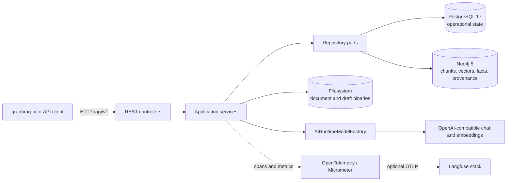

# System architecture

GraphRAG is an API-first Spring Boot application. Thin REST controllers delegate to workflow services, which use repository ports backed by PostgreSQL adapters or graph-only Neo4j adapters. Model-produced graph payloads and Cypher are never trusted without validation.

## Container and service flow

The default profile can boot without model beans. AI-backed services resolve the active knowledge-base profile at operation time and obtain revision-scoped clients from `AiRuntimeModelFactory`.

## Layer boundaries

1. **Controllers and DTOs** own HTTP mapping, validation, response status, and metadata-only request logging.
2. **Services** own lifecycle rules, admission, orchestration, cleanup, and policy snapshots.
3. **Repository ports** express persistence needs without making domain workflows depend on adapter details.
4. **PostgreSQL adapters** persist all operational aggregates in Flyway's `app` schema.
5. **Neo4j adapters/services** persist retrieval chunks and graph-native facts/evidence/provenance only.
6. **Filesystem storage** owns binary bytes; PostgreSQL owns their metadata and state.

Cross-store operations are explicit workflows rather than distributed transactions. Services record durable state, perform bounded work, and apply cleanup/recovery rules when later steps fail.

## Document ownership

Document consolidation (roadmap step 4) is implemented. `documents.api` owns
`DocumentController`, `ChunkingStateController`, and API models.
`documents.application.management` owns upload, replacement, deletion, storage
mutation/reconciliation, and chunking-state workflows.
`documents.application.processing` owns parsing/chunking orchestration, processing
stages, extraction validation, run lifecycles, recovery, and public capability
facades. `bootstrap.DocumentsProcessingConfiguration` injects assembled stages
into `DocumentProcessingService`.

`documents.domain` contains operational records and deterministic parsing,
chunking, hierarchy, contextual-text, metadata, revision, and extraction values.
Pure rules have no persistence annotations, effect clients, or adapter/workflow
dependencies. `documents.ports` expresses relational, binary, chunk, graph-write,
cleanup, and model effects. `documents.adapters` owns their relational, graph,
binary, parsing, chunking, and model integrations. The mapped SDN
`DocumentChunkEntity` is separate from the plain `DocumentChunkNode`; labels,
properties, queries, IDs, and optimistic-version behavior are preserved.
The binary adapter delegates shared storage primitives; draft storage stays shared.

Document processing and migration preparation use AI-owned
`EmbeddingCompatibility` and immutable non-secret `EmbeddingTarget` values.
Relational checkpoints remain separate from model, filesystem, and graph effects;
scoped cleanup, persisted snapshots, stale-run recovery, and the absence of an
enclosing cross-store transaction are unchanged.

`ArchitectureBoundaryTest` and `FinalSupportBoundaryTest` enforce permanent
feature, domain, model, support, and assembly boundaries. All roadmap exceptions,
including the step-nine support/assembly pairs, are retired. Existing transaction
self-calls are governed separately by exact method signatures, with no class-wide
or package-wide transaction exemption.

## Reprocessing execution and recovery boundary

Schemas owns reprocessing plan state, conditional claims, target guards, item
completion, retry decisions, and counter repair. `ReprocessingItemExecution` uses
the schemas-owned `ReprocessingDocumentExecutor` port; recovery uses
`ReprocessingProcessingOutcomeReader`. The ports carry immutable values with
distinct schema-activation and chunk-migration targets, without persistence
entities, runtime chunking contexts, model clients, or provider keys.

`bootstrap.integration.reprocessing` maps these ports to the documents-owned
`DocumentReprocessing` and `DocumentProcessingOutcomes` capabilities. The
documents facades check source identity, restore saved migration inputs, scope
the processing profile, and inspect owned processing runs. They delegate to
document-owned `DocumentProcessingService` and repository ports.
The adapters add no transactions or business decisions, and features do not
depend on their implementation.

The source-check operation runs after the item claim and before target decoding.
A missing/replaced source completes as non-retryable `STALE_SOURCE`; a source
lookup failure propagates, leaving the claim for recovery. Execution follows a
matching check without a repeated lookup, preserving the existing race semantics.

Recovery retains the historical predicate: an active completed run must match
the item's source hash, the chunker revision when required for migration, and a
start time no earlier than the item's start when present. Activation does not
require a chunker revision or additional schema/profile matching. Relational
claims and checkpoints remain separate from model, filesystem, and graph work.

Preparation and document-specific target inspection use the schemas-owned
`ReprocessingDocumentPreparation` port, mapped to `DocumentMigrationPreparation`
and `DocumentMigrationPreparationFacade`. Documents owns ownership-safe source
summaries, parser/options resolution, chunk presence and completed-run
classification, and chunker/embedding target inspection. Requests capture profile
identity/revision and non-secret embedding/tokenizer inputs; runtime objects and
provider keys never cross these contracts.

Schemas retains activation/chunk selection policy, schema target checks, blocker
priority, preview counts/pagination, durable snapshot assembly, retry lineage,
and destructive-plan exclusion. Preview and creation share read-only preparation;
creation recomputes facts and rejects stale revisions or blockers before plan
persistence. Classification still covers all owned documents before selection,
including explicit-ID previews. Target inspection preserves currentness semantics.

`ArchitectureBoundaryTest` now rejects document internals throughout preparation,
execution, retry, recovery, and currentness without preparation exceptions.
Integration adapters only map public immutable values. Synchronous document reads
participate in existing caller transactions; plan checkpoints and scheduling after
commit remain schema-owned. HTTP contracts, SQL, canonical snapshot JSON and
fingerprints, processing algorithms, and the recovery predicate remain unchanged.
AI compatibility uses AI-owned rules and stored-observation ports; document ownership is consolidated as described above.

## Knowledge-base lifecycle and AI state boundaries

`KnowledgeBaseService` owns existence checks, non-empty deletion admission, and
count → cleanup → relational-delete ordering. `OwnedDocumentState` and
`KnowledgeBaseArtifactCleanup` are knowledge-base-owned ports. Their mapping
adapter uses `KnowledgeBaseDocuments`, backed by `KnowledgeBaseDocumentsFacade`.
Documents retains owned-record inspection, graph/evidence/chunk cleanup, and
lexical-index removal. Non-empty deletion changes no records, binaries, or graph
artifacts. Cleanup failure prevents relational deletion; earlier external effects
retain existing partial-failure semantics, without cross-store rollback.

AI owns `EmbeddingTarget`, `StoredEmbeddingObservation`, `EmbeddingTokenizer`,
and `EmbeddingCompatibilityRule`. Historical normalized endpoint/model/dimension
hashes remain unchanged; resolved tokenizer is a separate compatibility condition.
Blank stored tokenizer falls back from the stored model. Missing space identity
is incompatible and is never backfilled. `EmbeddingCompatibility` reads
`StoredEmbeddingInformation` through the document `StoredEmbeddings` capability
and `StoredEmbeddingsFacade`, keeping the existing embedded-child chunk scope.
Contracts contain raw immutable facts without vectors, entities, or secrets.

AI profile update/delete reads `ProfileAssignments` through the knowledge-base
`AiProfileAssignments` capability and facade. `RelationalAiProfileRepository`
persists profiles only. Assignment and shared-profile compatibility checks run
before fields, revisions, defaults, associations, persistence, or client
invalidation change. Counts and assignments participate in caller transactions;
integration adapters under `bootstrap.integration.ai` and
`bootstrap.integration.knowledgebase` only map values and add no transactions.

Search readiness and dense retrieval use AI-owned `EmbeddingCompatibility` and
immutable non-secret `EmbeddingTarget` values. The obsolete
`EmbeddingSpacePolicy` bridge has been removed. AI owns the immutable `TokenizerId`, embedding-space values, and deterministic
endpoint/model/dimension identity rules under `ai.domain`. Shared vector and
lexical index maintenance is exposed by `indexes.contracts`, with Neo4j effects
confined to `indexes.adapters.graph`. Document writes/cleanup and search retrieval
use these public contracts. No foreign mutable profile state or provider key is
exposed. Architecture tests enforce pure rules/contracts, public-capability
mapping, feature-to-bootstrap isolation, and shared-index adapter boundaries.
Document consolidation (step 4), schema registry/discovery boundaries (step 5),
and draft authoring ownership (step 6) are implemented. Registry definitions,
parser, validator, persistence adapter, and active resolver live under
`schemas.registry`. Knowledge-base association state lives under `knowledgebase`;
registry workflows use its admission and association capabilities through
mapping-only `bootstrap.integration.schemas` adapters. Association reads and
writes join the caller's relational transaction; activation retains the
knowledge-base lock and after-commit reprocessing trigger.

`schemas.contracts` exposes immutable, complete schema snapshots with stored
content and hash. Document extraction resolves the active or expected schema
through this contract, preserving revision checks. `schemas.discovery` owns
input preparation, orchestration, model-response interpretation, and aggregation.
Document source reads and file parsing come from the `DocumentSourceInputs`
capability, whose immutable values carry no storage paths or persistence records.

## Schema draft authoring boundary

`schemas.drafts` owns authoring API mapping, lifecycle, durable source and
revision state, analysis and recovery, review decisions and conflicts, navigation,
and draft storage journaling. Its `api`, `application`, `domain`, `ports`, and
`adapters` packages keep draft rules and persistence with the schema feature.
Relational checkpoints remain separate from external processing. Draft-owned
text/file bytes use a schema-owned binary port and adapter over shared storage;
referenced document binaries stay in documents. No SQL or binary migration is
required, and existing source history, snapshots, and workflow behavior remain
readable.

`DraftDocumentInputs` supplies scoped owned-document metadata and fingerprints
through `documents.contracts.DocumentSourceInputs`, provided by
`documents.application.inspection.DocumentSourceInputsFacade`; content reads
and parsing use the same public capability. The immutable values carry
identifiers, hashes, metadata, and defensively copied bytes without document
records or local paths. Schemas retains source revisions, stale and unavailable
classification, analysis bounds, and run policy. Loaded document bytes are
checked against the captured source hash before parsing, including when a
replacement commits between metadata inspection and content loading.

`DraftSchemaLookup` maps `schemas.contracts.StoredSchemaSnapshots`, provided by
`schemas.registry.application.StoredSchemaSnapshotsFacade`, to immutable
snapshots for base-schema association, stored definition, and content hash
checks without parsing. Review inheritance requests a parsed stored snapshot
separately. `DraftKnowledgeBases` maps managed knowledge base admission, active
schema ID, and non-secret active AI profile facts, including profile ID and
revision, from `knowledgebase.contracts.DraftKnowledgeBaseFacts`. These
`bootstrap.integration.schemas` adapters only map values and add no transactions;
synchronous reads join their caller's transaction. Model client construction
remains AI-owned.

Draft navigation consumes `DraftEvaluationSummaries` and
`DraftReprocessingSummaries` through mapping-only bootstrap adapters. Evaluation
and reprocessing own the immutable batch summaries, including latest/current
resource references; list mapping does not read downstream repositories or issue
one detail request per draft. Stable ordering, filtering before totals, and
pagination remain compatible. All roadmap exceptions are retired; permanent
rules reject foreign state and implementation dependencies.

## Schema evaluation and publication boundary

Roadmap step 7 is implemented under `schemas.evaluation`, `schemas.publication`,
and `schemas.reprocessing`. Each area owns its API/domain values, workflow state,
repository ports, relational adapters, checkpoints, and recovery. Evaluation and
reprocessing also own their history/currentness summaries. Draft-owned
`DraftAdmissions`, `DraftReviewInputs`, `DraftContributors`, and
`DraftPublicationLink` expose immutable authoring preconditions and linkage
without persistence records or repositories.

Evaluation consumes document inventory/preparation through `EvaluationDocuments`
and per-chunk dry extraction through `EvaluationDryExtraction`, mapped by
`bootstrap.integration.schemas` to public document capabilities. Documents owns
source loading, parsing, chunk splitting, profile/client selection, and extraction
validation. Raw and validated immutable observations retain invalid/dropped
values needed by schema-owned deterministic metrics. Dry extraction creates no
document processing/extraction runs, chunks/embeddings, graph facts, or
relationships. Binary/model work remains outside relational checkpoints.

The outcome loop preserves source-check, reusable-outcome, client-availability,
preparation, extraction, metric, and checkpoint ordering. Eligibility, historical
contributor fallback, live chunking/profile behavior, canonical decision timestamps,
reuse fingerprints, and deterministic advisory fallback remain unchanged. No new
source-race or profile-revision enforcement is introduced.

Publication consumes registry operations through `SchemaRegistryCapabilities`
and evaluation qualification facts through `PublicationEvaluationQualifications`.
It owns readiness and blocker ordering, exact revision/hash guards, identity
claims, and durable publication intent. Registry creates/associates an ordinary
inactive schema. Resume reconciles the exact associated identity/content;
completion persists publication and invokes draft-owned linkage in the same
relational transaction. Retrieval retains missing-schema, content-drift, and
registry active-status reporting. Publication does not activate or process
documents.

Reprocessing reads immutable stored schema and publication facts and non-secret
knowledge-base/profile facts. `ReprocessingCheckpointService` owns plan creation,
destructive-plan exclusion, and repair. `SchemaActivationReprocessing` preserves
the registry lock and after-commit activation trigger. The preparation, execution,
claim/recovery, and snapshot guarantees above remain unchanged. Mapping adapters
add no transactions; synchronous fact reads join the caller's transaction.
Existing HTTP/SQL mappings, historical JSON, and canonical fingerprint bytes
remain compatible without SQL or binary migration. Architecture tests reject
foreign implementation/persistence access and retire the exact step-7 exceptions;
search and support consolidation retire the remaining exact step-8 and step-9
edges. Independent transaction self-calls retain their historical participation.

## Search ownership

Query/ask and advanced search are consolidated under `search.query`,
`search.retrieval`, `search.ranking`, `search.answering`, and `search.runs`. These
areas own their API values, workflows, deterministic policy, effect ports and
adapters, and durable run state. `search.query.adapters.graph` owns query
execution and planner inspection; `search.retrieval.adapters.graph` owns graph,
text, and parent-context retrieval; `search.runs.adapters.relational` owns run,
attempt, and result persistence. Existing SQL mappings, JSON snapshots, result
payload version, API responses, and recovery semantics remain unchanged.

Search obtains document names and content types through document-owned
`DocumentMetadataAccess`. `SearchDocumentMetadataAdapter` maps these immutable
facts to search ports; citation lookup is bounded to 128 IDs and metadata-based
selection to 200 results. `SearchKnowledgeBaseAccess` provides scoped admission
and non-secret active schema/profile IDs. `SearchSchemaAdapter` maps the
schema-owned `StoredSchemaSnapshots`, `SchemaSnapshots`, and
`CapturedSchemaParsing` capabilities to `SearchSchemas`. Readiness checks schema
availability without parsing, run creation captures the exact stored content and
hash, and workers parse that captured content rather than current registry state.
The bootstrap adapters only map values and add no transactions; synchronous reads
participate in the caller's relational transaction.

AI owns search embedding compatibility through `EmbeddingCompatibility` and
`EmbeddingTarget`. `GraphPlanValidation` is a domain value; plan validation and
rendering rules remain under `search.retrieval.domain`, while
`AdvancedSearchPlanValidator` and
`search.retrieval.application.validation.GraphPlanValidationService` are
application workflows. Model-dependent planning, dense embedding, reranking,
sufficiency, and answer synthesis use search model adapters, keeping client
construction and profile support AI-owned.

Search composes `QueryPolicy` from a captured typed query snapshot. Search model
adapters use AI-owned model capabilities; workflows use SDK-free execution and
profile facts. `search.runs.adapters.metrics.AdvancedSearchMetrics` interprets
search outcomes; generic AI observations remain independent of search. Document
persistence and cleanup use shared index contracts and do not depend on search.

## Final support and assembly ownership

Roadmap step 9 is implemented. `settings` owns its API, catalog, codecs,
validation, lifecycle, override ports, and relational adapters. Foreign workflows
consume `RuntimeSettingsAccess` and immutable typed snapshots. Settings delegates
chunk revision inspection through its own `ChunkRevisionInspection` port, mapped
by `bootstrap.integration.settings` to `DocumentChunkRevisions`. The document
calculator uses only the supplied snapshot; reporting and hashing use the same
captured values, without live-setting re-reads or automatic reprocessing.

`ai.profiles` owns profile API, mutable state, management, and relational
persistence. `AiProfileAccess` exposes immutable non-secret facts and masked views.
`ai.adapters.provider` owns revision-scoped caches and provider construction;
`ai.models` exposes model-resolution capabilities. Provider SDK handles stay in
model adapters, AI resolution, and bootstrap. `ai.execution` supplies profile scope
and opaque captured execution so durable work retains its selected model and
nested scopes restore correctly after success or failure.

Startup properties are bound in their owned configuration areas: AI model,
indexes/Neo4j, storage, settings query/chunking/extraction, observability, search,
and schema drafts. `bootstrap.AppProperties` is an assembly aggregate;
`SettingsStartupDefaults` and `StartupModelMetadata` expose only the facts needed
by their consumers. Provider credentials remain confined to AI and assembly.

`bootstrap` owns factories, provider registration, schema startup loading,
default-profile seeding, executors, schedulers, and explicit persistence scans.
The primary `transactionManager`, `neo4jTransactionManager`, and transaction-aware
`neo4jTemplate` retain their names and routing. Assembly can wire concrete owned
implementations. `bootstrap.integration` has narrower privileges: it maps public
capabilities to consumer-owned ports without repositories, SDK/filesystem clients,
transactions, or business policy. Synchronous reads retain caller participation.

Shared support is limited to metadata-only `logging`, binary `storage`, immutable
`http.contracts` pagination/common errors, generic `observability`,
`persistence.transaction` annotations, and `indexes` contracts/graph adapters.
Global problem adaptation lives in `bootstrap.http`; feature API values and
errors remain with their owners. Schema generation prompts, normalization, and
model interpretation live under `schemas.generation`.

The permanent source graph permits search → documents/schemas/knowledge bases/AI,
documents → schemas/knowledge bases/AI, schemas → knowledge bases/AI, and knowledge
bases → AI through public contracts. Schemas obtains document effects through its
own ports and bootstrap mappings. All features can consume typed settings;
settings can consume immutable AI identity values. Domains cannot reach live
accessors, workflows, or effect adapters. No roadmap-frozen pairs remain.
HTTP/JSON/SQL identities, property keys/defaults, fingerprints, index names,
cache semantics, metrics, and checkpoint boundaries remain compatible; no SQL or
binary migration is required.

## Major flows

- Ingestion: upload → SHA-256 dedup → filesystem binary + PostgreSQL metadata → parse → chunk → embed → Neo4j chunks/vector index → schema-constrained extraction → validated graph write.
- Safe Cypher: prompt/manual Cypher → schema and keyword checks → Neo4j `EXPLAIN` → limit policy → read-only execution.
- Advanced search: readiness/admission → durable PostgreSQL run → planned dense/lexical/metadata/graph branches → fusion/reranking → sufficiency/follow-up → cited synthesis → atomic result publication.
- Schema drafts: durable sources and revisions → bounded analysis → review decisions/conflicts → held-out evaluation → inactive publication → explicit activation → optional reprocessing plan.

## Implementation source map

| Area | Entry points | Core implementation |
|---|---|---|
| Schema registry and discovery | `schemas/registry/api/SchemaController.java` | `schemas/registry/application/SchemaRegistryService.java`, `schemas/discovery/application/SchemaDiscoveryService.java`, `schemas/registry/application/SchemaParser.java`, `schemas/registry/application/SchemaValidator.java` |
| Schema draft authoring | `schemas/drafts/api/SchemaDraftController.java` | `schemas/drafts/application`, `schemas/drafts/domain`, `schemas/drafts/ports`, `schemas/drafts/adapters` |
| Knowledge bases and profiles | `knowledgebase/api/KnowledgeBaseController.java`, `ai/profiles/api/AiProfileController.java` | `knowledgebase/application/KnowledgeBaseService.java`, `ai/profiles/application/AiProfileService.java`, `ai/adapters/provider/AiRuntimeModelFactory.java` |
| Documents and chunks | `documents/api/DocumentController.java`, `documents/api/ChunkingStateController.java` | `documents/application/management/DocumentUploadService.java`, `documents/application/processing/DocumentProcessingService.java`, `documents/application/processing/ChunkingService.java` |
| Schema evaluation | `schemas/evaluation/api/SchemaDraftEvaluationController.java` | `schemas/evaluation/application`, `schemas/evaluation/domain`, `schemas/evaluation/ports`, `schemas/evaluation/adapters`, `bootstrap/integration/schemas` |
| Schema publication | `schemas/publication/api/SchemaDraftPublicationController.java` | `schemas/publication/application`, `schemas/publication/domain`, `schemas/publication/ports`, `schemas/publication/adapters`, `schemas/contracts` |
| Reprocessing preparation, execution, and recovery | `schemas/reprocessing/api/SchemaReprocessingPlanController.java` | `schemas/reprocessing/application`, `schemas/reprocessing/domain`, `schemas/reprocessing/ports`, `schemas/reprocessing/adapters`, `documents/contracts`, `documents/application/processing`, `bootstrap/integration/reprocessing` |
| Graph extraction | document processing endpoint | `documents/application/processing/GraphExtractionService.java`, `documents/adapters/graph/GraphWriteService.java` |
| Search API | `search/query/api/QueryController.java`, `search/runs/api/AdvancedSearchRunController.java` | `search/query/application`, `search/retrieval`, `search/ranking`, `search/answering`, `search/runs` |
| Search integration | `bootstrap/integration/search` | `SearchDocumentMetadataAdapter`, `SearchKnowledgeBaseAdapter`, `SearchSchemaAdapter` |
| Runtime settings | `settings/api/RuntimeSettingsController.java` | `settings/application/RuntimeSettingsService.java`, `settings/contracts/RuntimeSettingsAccess.java` |
| Observability | all AI workflows | `observability/AiObservationService.java` |

All paths above are relative to `src/main/java/io/github/vfedoriv/graphrag/`. For exhaustive routes and DTOs, use [Swagger/OpenAPI](../reference/api.md).
