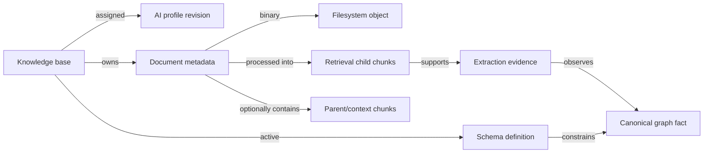

# Domain model

GraphRAG separates operational resources from graph-native knowledge. IDs in examples are opaque unless an endpoint explicitly asks the client to choose one.

## Core concepts

**Knowledge base**
: The ownership and query scope. Its ID is client-defined and stable. It holds an active schema reference and an assigned AI profile.

**AI profile**
: A PostgreSQL-backed, revisioned OpenAI-compatible provider configuration. API keys are write-only. Chat/embedding model, provider, dimensions, and resolved tokenizer form a compatibility boundary once embedded chunks exist.

**Schema definition**
: A validated JSON document with immutable `name + version` identity. It declares allowed node labels, relationship types, properties, keys, and indexes. A knowledge base may attach versions and has one active schema used by extraction and Cypher safety.

**Document**
: PostgreSQL metadata and a filesystem binary owned by one knowledge base. SHA-256 enables within-knowledge-base deduplication and reproducibility checks. Processing status describes the current attempt.

**Chunk**
: A bounded source segment. Retrieval child chunks carry embeddings and source offsets; hierarchical strategies can also persist parent/context chunks. Chunks snapshot strategy, settings, tokenizer/count mode, representation, and effective chunker revisions so later configuration changes do not rewrite history.

**Graph fact**
: A schema-defined Neo4j node or relationship extracted from chunk content. Direct knowledge-base/document scope prevents cross-tenant retrieval and supports cleanup.

**Evidence**
: The durable association between an extracted observation and its sources. It records source chunks/ranges, schema, processing/extraction run, confidence, and revision information. Multiple observations can support the same canonical fact.

**Provenance**
: The complete trace from a returned fact or citation back through evidence to document, chunk, source offsets, processing attempt, active schema, and profile/settings snapshots.

## Relationships

## State and mutation invariants

- Schema identity never changes after save. Only inactive content with the same identity may be replaced; active schemas cannot be updated or deleted.
- Profile assignment/mutation leaves the previous active profile unchanged if existing chunks make provider/model/dimension/tokenizer changes incompatible.
- Chunk configuration updates affect subsequent attempts; existing and in-flight attempts keep their snapshots.
- Document overwrite requires explicit confirmation after completed extraction.
- Query execution is read-only and must pass the validator.
- Draft review state is append-only/auditable; publication creates one ordinary inactive schema and never activates or reprocesses implicitly.

Continue with the [knowledge-base/profile](../workflows/knowledge-bases-profiles.md), [schema](../workflows/schemas.md), and [document](../workflows/document-processing.md) workflows.
