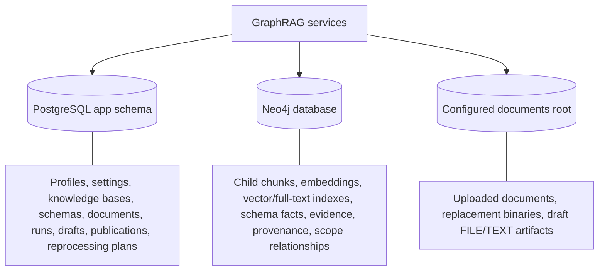

# Persistence ownership and operational state

PostgreSQL is authoritative for operational decisions and lifecycle state. Neo4j contains graph-native retrieval and extracted knowledge. The filesystem stores binary content. Keeping those boundaries explicit prevents graph cleanup from accidentally becoming business-state deletion and prevents local binaries from masquerading as durable metadata.

## PostgreSQL: operational authority

Flyway manages the `app` schema. PostgreSQL owns AI profiles and revisions, runtime overrides, knowledge bases and assignments, schema versions and activation, document metadata/status, processing/extraction records, durable advanced-search runs/results, schema-draft workflow state, publication records, storage mutations, and reprocessing plans/items.

Durable workflows snapshot the inputs that affect reproducibility: revisions, hashes, selected profiles, policy/settings fingerprints, and source membership. Startup recovery closes abandoned running work according to each workflow's retry rules.

## Neo4j: retrieval and graph facts

Neo4j stores retrieval child chunks and embeddings, optional parent/context chunks, vector and lexical indexes, schema-defined domain nodes/relationships, extraction evidence, provenance, and direct knowledge-base/document scope used by graph retrieval and cleanup. It does not own operational knowledge-base, schema, document, profile, setting, draft, publication, or reprocessing aggregates.

Extraction is constrained to labels and relationship types in the active schema. Evidence connects graph facts to source document/chunk, processing run, schema revision, confidence, and bounded source ranges.

## Filesystem: binary bytes

`app.storage.documents-root` defaults to `./var/documents`. The filesystem stores uploaded document bytes plus draft-owned file/text artifacts. PostgreSQL stores their metadata, hashes, status, and ownership. Replacing, deleting, or abandoning work must coordinate metadata and binary cleanup; deleting a draft source never deletes an independently owned knowledge-base document.

## Cleanup boundaries

- Document replacement removes obsolete chunks, extraction runs, document-scoped graph relationships, unreferenced extracted nodes, and the old binary before the replacement becomes authoritative.
- Document deletion removes the document's binary and derived artifacts.
- Processing failure cleans partially written derived graph/chunk artifacts while preserving durable failure metadata.
- Schema-draft deletion removes draft-owned artifacts only; referenced documents and registered schemas remain.
- Reprocessing overwrites derived artifacts per item and does not silently change source binaries.

## Langfuse persistence is separate

The optional Langfuse deployment shares the PostgreSQL server through a different `langfuse` database and uses separate Garage metadata/data volumes for event/media objects. Never drop the `langfuse` database, delete `langfuse_postgres_data`, or separate the `langfuse_garage_meta` and `langfuse_garage_data` backups. See [deployment safety](../operations/deployment-troubleshooting.md).
