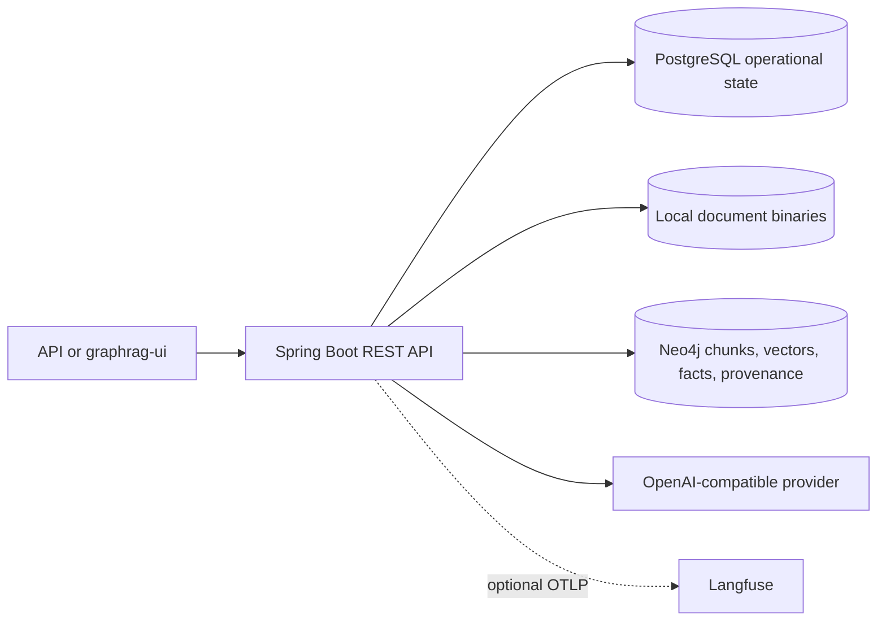

# GraphRAG documentation

This is the canonical cross-stack documentation for the GraphRAG system. The backend repository owns runtime behavior, API contracts, persistence boundaries, and operational guidance. The [GraphRAG UI repository](https://github.com/vfedoriv/graphrag-ui) owns frontend controls, screenshots, and browser-specific behavior.

The sources are ordinary Markdown under `src/site/markdown`, so they remain readable on GitHub. Runtime [Swagger UI](http://localhost:8080/swagger-ui/index.html) and [`/v3/api-docs`](http://localhost:8080/v3/api-docs) remain the exhaustive endpoint and DTO reference.

Implementation stack: Java 25, Spring Boot 4.1.0, PostgreSQL 17, Neo4j 5, Spring AI 2.0.0, LangChain4j 1.16.2, OpenTelemetry/Micrometer, and the Maven Wrapper.

## Choose a path

- **Getting Started**: [provision local services](getting-started/local-setup.md), select an AI profile, check health, and complete a [first end-to-end run](getting-started/first-run.md).
- **Concepts**: understand the [service architecture](concepts/architecture.md), [persistence ownership](concepts/persistence.md), and [domain model](concepts/domain-model.md).
- **Workflows**: follow knowledge-base/profile setup, schemas and drafts, document processing, chunk migration and reprocessing, safe Cypher, and durable advanced search.
- **Operations**: manage configuration and runtime settings, privacy-aware observability, deployment, persistence safety, and troubleshooting.
- **Reference**: use the curated API map, RFC 7807 error guide, schema format, glossary, and external references.
- **Contributing**: tour the codebase, run the right tests, and maintain this portal.

## System at a glance



## Build and preview

```bash
./mvnw site
./mvnw site:run
```

The build writes HTML to `target/site`. The preview command serves the generated site locally; stop it with `Ctrl+C`. Mermaid source is portable on GitHub, while the generated HTML loads the pinned Mermaid 11.15.0 browser module when a page contains a diagram.

Generated HTML is build-verified but is not published by this repository. See [documentation maintenance](contributing/documentation.md) before changing navigation or shared facts.
