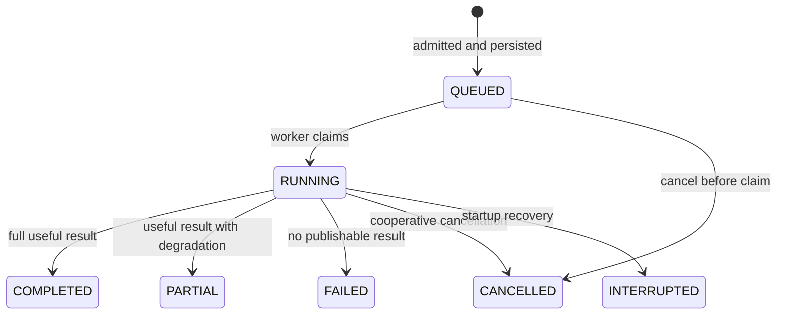
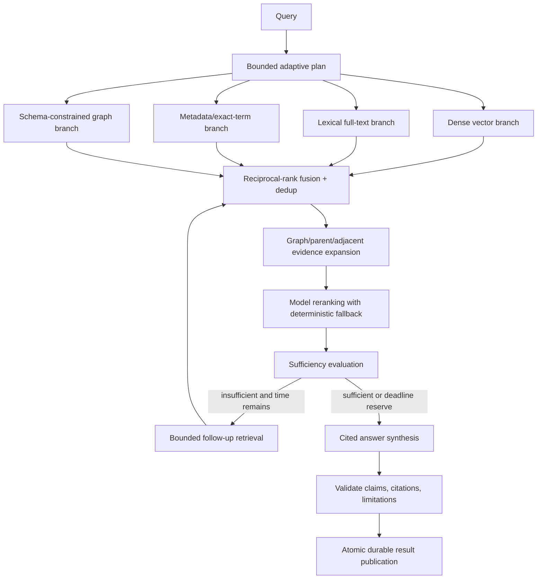

# Durable advanced search

> This backend page is canonical for readiness, retrieval, run state, citations, cancellation, and retention. The frontend repository owns the [Advanced Search UI guide](https://github.com/vfedoriv/graphrag-ui/blob/main/docs/advanced-search/README.md), including controls, screenshots, and browser behavior.

Advanced search creates a PostgreSQL-backed run and executes bounded retrieval/synthesis asynchronously. It is separate from one-shot `/ask` and never falls back to the retired hybrid-search API.

## Readiness and admission

Call `GET /api/v1/knowledge-bases/{knowledgeBaseId}/queries/advanced-search-runs/readiness`. The deterministic check does not contact a provider. It reports profile, corpus/index, active schema, graph-branch availability, blockers, and informational status.

Submission rechecks readiness before queue capacity and durable run creation. A blocker returns RFC 7807 HTTP 409 and leaves no run behind. Queue overload is also rejected before orphan state is created.

```http
POST /api/v1/knowledge-bases/kb-demo/queries/advanced-search-runs
Content-Type: application/json

{"query":"pump maintenance","maximumEvidence":10,"includeEvidenceText":true}
```

HTTP 202 returns the full query, applied options, status, and status/result/cancellation links. List responses use a whitespace-normalized `queryPreview` bounded to 160 Unicode code points; run detail retains the full query.

## Durable lifecycle



Poll `GET .../advanced-search-runs/{runId}` until `COMPLETED`, `PARTIAL`, `FAILED`, `CANCELLED`, or `INTERRUPTED`. Fetch `.../{runId}/result` only when a result is available. Ownership is checked on every list/detail/result/cancel route.

Cancellation is idempotent. A queued run can be cancelled immediately; running work observes cancellation between bounded stages/branches and does not publish a later result over terminal cancellation.

## Retrieval and synthesis pipeline



The planner can produce bounded subqueries, exact terms, and typed graph requests; plan validation clamps or rejects unsafe/unbounded model output. Dense, lexical, metadata, and graph retrieval are knowledge-base scoped. Fusion deduplicates candidates, graph/parent expansion adds context without turning context-only chunks into cited hits, and reranking preserves a deterministic fallback when the model stage is unavailable.

Sufficiency can trigger bounded follow-up queries only while deadline budget remains. Synthesis reserves time, receives a citation catalog, and must produce claims whose `citationIds` reference returned evidence. The validator rejects unknown citations and inconsistent limitations before result publication.

## Results, citations, and partial success

The typed version-1 result contains answer/claims, ranked evidence, snapshotted document/chunk source metadata and ranges, context-only parents, graph facts, citation IDs, limitations, and per-attempt/branch diagnostics. `includeEvidenceText=false` suppresses evidence text while preserving provenance metadata.

`PARTIAL` means useful evidence/answer was retained while an optional branch or later stage degraded. Inspect the run `failureCategory`, answer limitations, and `result.diagnostics.attempts`. A required-stage failure with no valid publishable answer is `FAILED`.

## Bounds and retention

Local defaults: 10 evidence items, maximum 20, candidate limit 60, maximum candidates 200, rerank pool 20, query length 4000, and deadline 60 seconds. Runs/results are retained for 24 hours and cleaned in batches of 100. Runtime settings can change these typed bounds live for subsequent admissions; each run snapshots applied values.

Implementation: `AdvancedSearchRunController`, `AdvancedSearchReadinessService`, `AdvancedSearchRunService`, `DefaultAdvancedSearchRunProcessor`, planner/branch/fusion/expansion/reranker/sufficiency/synthesis/answer-validator services, and relational run/result repositories.
