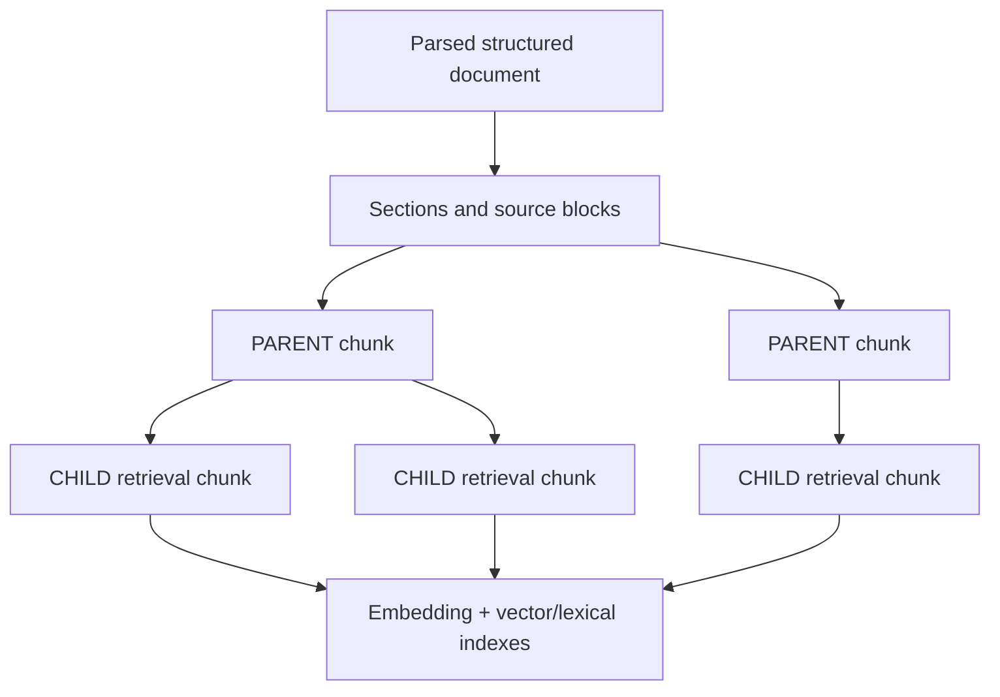
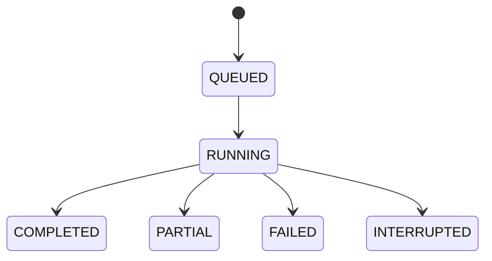

# Chunking and reprocessing

> This backend page is canonical for chunk contracts, migration decisions, and reprocessing state. The frontend repository owns the [Chunking UI guide](https://github.com/vfedoriv/graphrag-ui/blob/main/docs/chunking/README.md), including controls, screenshots, and browser behavior.

Chunking configuration is live for subsequent processing attempts, never retroactive. Every run and chunk snapshots enough identity to explain exactly how it was produced.

## Strategies and hierarchy

The current default strategy is `recursive`. It splits structured parsed content with token-aware boundaries, preserves reliable source/page offsets and structural paths, builds bounded parent chunks, and persists retrieval `CHILD` chunks with context-header representation. `fixed-character` remains available for compatibility and produces flat child chunks.

Canonical settings are `strategy`, `target-tokens`, `overlap-tokens`, and `hard-character-limit`. Hierarchical settings include parent token/character/page bounds and context-header limits. `max-tokens` and `max-characters` are compatibility aliases; canonical keys win when both are present.



Known compatibility behavior: the virtual `FLAT` inspection filter means persisted child chunks whose `parentChunkId` is null; it is not a third persisted kind. `parentChunkId` is invalid with `kind=FLAT`. The complete-list chunk endpoint remains for existing clients, but bounded page/hierarchy/direct routes are preferred.

## Snapshot identity

At attempt start, the pipeline records strategy name/revision, canonical settings hash, tokenizer ID/revision, exact or conservative token-count mode, parser policy revision, representation revision, source hash, and effective chunker revision. Chunks also retain offsets and hierarchy identity. In-flight runs keep that snapshot even if runtime settings change.

Profiles may explicitly select `cl100k_base`. Known OpenAI embedding models resolve to it automatically; unknown models use versioned conservative `utf8-byte-v1` counting. The resolved tokenizer participates in embedding-space compatibility.

## Inspect current state

`GET /api/v1/chunking-state` reports the active strategy/settings, tokenizer/count mode, parser and representation revisions, settings hash, effective target revision, lifecycle, and supported strategies. Use the document chunk routes described in [document processing](document-processing.md) to compare stored snapshots.

## Preview a migration

Before changing existing documents, call:

```http
POST /api/v1/knowledge-bases/{knowledgeBaseId}/chunk-migrations/preview
Content-Type: application/json

{
  "selection": "OUTDATED_STRATEGY",
  "documentIds": [],
  "processingOptions": {}
}
```

The preview is read-only. It returns readiness blockers, the active schema/hash, profile revision, embedding space, expected chunker revision, classification counts (`noChunks`, `outdated`, `current`), selected count, and a bounded document page. Resolve blockers—missing active schema/profile or incompatible target—before plan creation.

## Execute a durable plan

Create `POST /knowledge-bases/{knowledgeBaseId}/reprocessing-plans` with an explicit reason/selection, selected document IDs or `allDocuments`, optional processing options, and the previewed `expectedChunkerRevision`. Schema-activation plans may identify the draft/schema; chunk-migration plans use the target revision guard.



Each item is independently `QUEUED`, `RUNNING`, `SUCCEEDED`, `FAILED`, `STALE_SOURCE`, `BLOCKED_TARGET_CHANGED`, `BLOCKED`, `INTERRUPTED`, or `SKIPPED`. The worker calls ordinary document processing with overwrite enabled. It refuses a changed source hash, schema/hash, profile target, or expected chunker revision rather than processing against a silently different snapshot.

List and poll plans through the reprocessing-plan routes. Retry creates a linked plan and requires `{"mode":"RESNAPSHOT_UNRESOLVED"}`; matching successes remain complete while unresolved sources are deliberately resnapshotted. Startup recovery interrupts abandoned queued/running work and keeps it auditable/retryable.

Implementation: `documents.api.ChunkingStateController`,
`documents.application.management.ChunkingStateService`,
`documents.application.processing.ChunkingService`, deterministic strategies under
`documents.domain.chunking`, parser/tokenizer integrations under `documents.adapters`,
and schema-owned `ChunkMigrationController`. Reprocessing API values, plan/item
state, workflows, history/currentness, checkpoints, persistence, and recovery live
under `schemas.reprocessing`; its plan controller is
`schemas.reprocessing.api.SchemaReprocessingPlanController`. Document consolidation,
registry/discovery, draft authoring, and evaluation/publication/reprocessing
ownership (steps 4–7) are implemented. Document extraction consumes immutable
schema snapshots. See [document ownership](../concepts/architecture.md#document-ownership).

Preparation and target inspection run through schemas-owned consumer ports and
`DocumentMigrationPreparationFacade`. Documents resolves parser/options, captures
chunker and embedding targets, and classifies all owned sources before schemas
applies selection and pagination. Preview creates no work; creation recomputes
facts and rejects changed targets or blockers before saving plans/items. Existing
canonical snapshots and historical execution inputs remain compatible. Schemas
retains selection policy, retry lineage, destructive-plan exclusion, and scheduling
after commit. The reprocessing boundary is fully enforced without preparation
exceptions. AI compatibility uses AI-owned rules and stored-observation ports;
document ownership is consolidated. See the [architecture boundary](../concepts/architecture.md#reprocessing-execution-and-recovery-boundary).

Plan admission and currentness consume immutable stored schema/publication facts
and non-secret knowledge-base/profile identity, embedding, and tokenizer facts.
`ReprocessingCheckpointService` persists creation/repair and preserves exclusion
of concurrent destructive plans across both activation and chunk migration.
Registry activation invokes `SchemaActivationReprocessing` after commit; ordinary
plan creation also schedules its worker after the creation transaction commits.
Draft navigation obtains reprocessing history through bounded immutable batch
summaries instead of plan repositories.

Recovery repairs cardinality and counters from authoritative items and leaves
unexpired or newer claims owned by their current worker. Its existing completed
overwrite predicate remains source hash, required migration chunker revision, and
processing-run start no earlier than the item start when present; activation adds
no schema/profile/chunker match. Source checks still precede target decoding and
preserve the existing replacement race. Canonical snapshot bytes, HTTP/SQL
contracts, retry lineage, and separation of relational checkpoints from external
processing remain unchanged. The exact step-7 and step-8 exceptions are retired;
only identified support/assembly seams remain for step 9.
