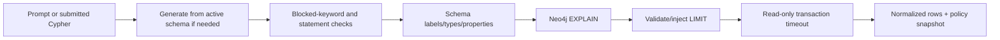

# Cypher generation, validation, and execution

GraphRAG treats generated and user-supplied Cypher as untrusted input. Every executable query passes the same read-only, schema-aware validation and Neo4j planner check.

## Surfaces

- `POST /knowledge-bases/{knowledgeBaseId}/queries/generate` with `{"prompt":"..."}` generates Cypher and parameters from active-schema context.
- `POST .../queries/validate` with `{"cypher":"...","parameters":{}}` returns validation and the effective query/policy without execution.
- `POST .../queries/execute` accepts the same shape, validates first, and returns normalized rows.
- `POST .../queries/ask` with `{"prompt":"..."}` performs generate → validate → execute once.

Generation requires an active schema and the KB's AI profile. Manual validation/execution still require the active schema because label, relationship, and property access is checked against it.

## Model output mode

Profiles default to `PORTABLE`. Explicit `NATIVE_JSON_SCHEMA` requests a strict,
closed Cypher envelope only on a verified compatible provider/model, with the
profile's existing model/timeout/retry options. Native parameter entries convert to
the ordinary public map, for example `"parameters":{"id":"C-1"}`; no provider
contract/version or entry wrapper appears in query responses. Nested values,
explicit nulls, and exact integers are preserved, subject to existing execution
type restrictions.

Refusal, incomplete completion, empty normal assistant text (even with JSON in
reasoning), invalid conversion, or native-format rejection/unavailability fails
generation before execution. No portable fallback or extra repair retry occurs.
Read-only/schema/limit/`EXPLAIN` validation below still decides whether decoded
Cypher can execute. Advanced-search planning, reranking, sufficiency, and synthesis
retain portable output, while reused Cypher generation follows its profile mode.

An omitted/null mode on profile update retains the current choice. Explicitly save
`PORTABLE` to roll back future resolutions; captured operations retain their prior
model/mode pair. See [profile modes](knowledge-bases-profiles.md#structured-output-mode)
for compatibility limits and the optional manual comparison recipe. Existing query
response and RFC 7807 error contracts remain in place.

## Safety policy

The validator rejects multiple/unsupported statements and configured mutating or procedural keywords. Local defaults block `CREATE`, `MERGE`, `SET`, `DELETE`, `DETACH`, `REMOVE`, `DROP`, `LOAD CSV`, and `CALL`. It then validates referenced labels, relationship types, and properties against the active schema and sends `EXPLAIN` to Neo4j for syntax/planner validation.

With `app.query.require-limit=true`, a missing top-level limit is injected as `LIMIT $__limit`. An explicit numeric or bound limit above `app.query.max-rows` is rejected; local max rows are 200. Execution applies the snapshotted `app.query.timeout-seconds` (15 locally) at the transaction boundary. The response includes the immutable applied policy under `validation.policy`.

These settings are typed live runtime settings, so a request uses one consistent policy snapshot even if an operator updates values concurrently.

## One-shot `/ask`

`/ask` is convenience orchestration, not a separate trust path. It resolves the active profile/schema, generates Cypher, validates and possibly limits it, executes read-only, and returns generation/validation/execution context. If any stage fails, later stages do not run.

Use durable [advanced search](advanced-search.md) when the user needs cited synthesis over vector, lexical, metadata, and graph evidence rather than raw Cypher rows.

## Failure behavior

- 400: invalid request, blocked keyword, schema violation, invalid/excessive limit, or `EXPLAIN` failure.
- 404: missing knowledge base or schema.
- 409: no usable active schema/profile or another explicit readiness conflict.
- 5xx: provider, Neo4j, or timeout failure normalized through RFC 7807.

Implementation: `search.query.api.QueryController`; application orchestration and safety policy in `search.query.application`; model calls in `search.query.adapters.model.SpringAiCypherGenerationClient`; and graph execution in `search.query.adapters.graph.QueryNeo4jExecutor`.
