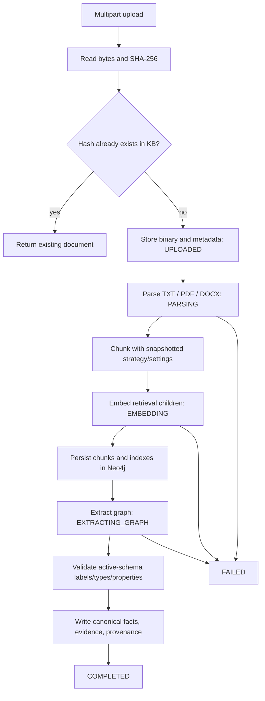

# Document processing

Documents are owned by one knowledge base. PostgreSQL stores metadata and state, the configured filesystem stores binary bytes, and Neo4j stores derived chunks, embeddings, facts, evidence, and provenance.



## Upload and deduplication

```bash
curl -X POST \
  http://localhost:8080/api/v1/knowledge-bases/kb-demo/documents \
  -F "file=@/absolute/path/to/contract.pdf"
```

The service reads the bytes, validates the upload, computes SHA-256, and deduplicates within the knowledge base. Re-uploading identical content returns the existing document metadata; the same bytes may be independently owned by another knowledge base. The local multipart limit is 100 MB.

Binary storage is tracked by durable storage mutations so recovery can reconcile a filesystem write with PostgreSQL metadata if one side fails.

## Process

```bash
curl -X POST http://localhost:8080/api/v1/documents/<documentId>/process
```

The synchronous pipeline resolves the document's KB profile and active schema, snapshots processing/chunking identity, parses structure and offsets, creates chunks, embeds retrieval children, ensures indexes, extracts graph candidates, validates them against the schema, and writes graph data with provenance.

Document status progresses through `UPLOADED`, `PARSING`, `EMBEDDING`, `EXTRACTING_GRAPH`, then `COMPLETED` or `FAILED`. A completed extraction is protected; repeat with `?allowOverwrite=true` or a body containing `allowOverwrite: true`. If query and body flags conflict, the request is rejected.

Document-specific processing option definitions/defaults are available under `/documents/{documentId}/processing-options`; saved defaults can be replaced or cleared, and per-run `options` override them after typed validation.

## Inspect chunks and provenance

- `GET /documents/{documentId}/chunks/page` is the bounded page route (`page`, `size`, `kind`, `parentChunkId`, `sectionIndex`).
- `GET /documents/{documentId}/chunks/hierarchy` returns bounded parent metadata and child counts without text.
- `GET /documents/{documentId}/chunks/{chunkId}` fetches one owned chunk.
- `GET /documents/{documentId}/chunks` is compatibility-only and returns the complete list.

Persisted kinds are `PARENT` and `CHILD`; virtual `FLAT` selects child chunks without a parent. Responses include source/page offsets, structural path, processing run, strategy/settings/tokenizer/representation revisions, source hash, and metadata needed to explain retrieval provenance.

## Replace and delete

`PUT /knowledge-bases/{knowledgeBaseId}/documents/{documentId}` stores a replacement multipart file, resets status, and removes document-scoped derived artifacts. Replacement is rejected if its SHA-256 duplicates another document in the same knowledge base.

`DELETE` on the same resource removes the binary, metadata, chunks, extraction/processing artifacts, document relationships, and canonical graph elements no longer supported by other evidence. Cleanup is strictly document-scoped so other documents and knowledge bases retain their facts.

## Failure cleanup

Partial processing failures record `FAILED` and a safe error message, remove partially produced chunks/extraction artifacts where required, and preserve the original binary for retry. Overwrite first removes obsolete completed-run evidence/relationships, then writes the new attempt. Application logs include identifiers, counts, hashes/fingerprints, status, timings, and exception class—not document text or extracted payloads.

Implementation: `DocumentController`, `DocumentUploadService`, `DocumentProcessingService`, the processing stages, `GraphExtractionService`, `GraphExtractionValidationService`, `GraphWriteService`, and `GraphArtifactCleanupService`.
