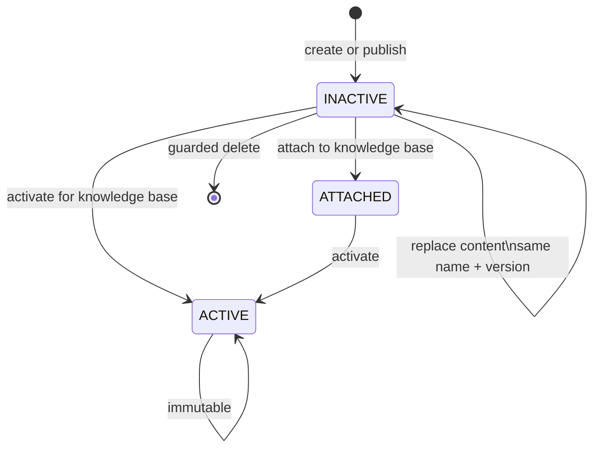

# Schema registry lifecycle

Schemas define the only labels, relationship types, keys, and properties that extraction and schema-aware Cypher may use. The registry persists validated JSON versions in PostgreSQL; activation selects one version for a knowledge base.



## Validate and create

Validate without persistence:

```bash
curl -X POST http://localhost:8080/api/v1/schemas/validate \
  -H "Content-Type: application/json" \
  -d '{"content":"{\"name\":\"legal-contracts\",\"version\":1,\"nodes\":[],\"relationships\":[]}"}'
```

Create and optionally associate the version with a knowledge base:

```json
{
  "content": "{\"name\":\"legal-contracts\",\"version\":1,\"nodes\":[{\"label\":\"Contract\",\"key\":\"contractId\",\"properties\":[{\"name\":\"contractId\",\"type\":\"string\",\"required\":true}]}],\"relationships\":[]}",
  "sourceType": "GENERATED",
  "knowledgeBaseId": "kb-contracts"
}
```

Send that body to `POST /api/v1/schemas`. Identity is the JSON document's `name + version`, not the database ID.

## Generate and discover

- `POST /schemas/generate` and `/schemas/generate/from-file` infer a candidate schema from text or a PDF/TXT/DOCX file.
- Knowledge-base-scoped generation routes resolve the KB's active AI profile.
- Example-generation routes infer representative extraction examples.
- `/knowledge-bases/{id}/schemas/discover` and `/discover/from-files` aggregate multiple owned documents, pasted text, or request files into review-only candidates with evidence, support counts, conflicts, and partial source outcomes.

Generation output is still validated before optional save. For sustained, auditable multi-source work use [schema drafts](schema-drafts.md).

## Attach and activate

`POST /knowledge-bases/{knowledgeBaseId}/schemas/{schemaId}/attach` associates an inactive schema without making it active. `POST .../activate` makes it the active extraction/query contract. Activation is explicit; creating, attaching, draft publication, and evaluation never activate implicitly.

After activation, existing documents are not silently rewritten. Use a durable [reprocessing plan](chunking-reprocessing.md) when existing derived data must follow the new schema.

## Guarded mutation

- `PUT /schemas/{schemaId}` can replace only an inactive schema's content.
- Replacement JSON must retain exactly the same `name + version`.
- Active schemas cannot be updated or deleted.
- `DELETE /schemas/{schemaId}` is rejected while active for any knowledge base.
- Schema validation rejects duplicate/invalid labels, relationships, properties, keys, or index definitions.

These conflicts return RFC 7807 HTTP 409; validation failures return HTTP 400. List with `GET /schemas` or `GET /knowledge-bases/{knowledgeBaseId}/schemas`, and fetch one with `GET /schemas/{schemaId}`.

See the [schema-format reference](../reference/schema-format.md) for a complete representative document and runtime Swagger/OpenAPI for exhaustive request/response shapes.

Implementation: `SchemaController` maps the API to `schemas.registry` and
`schemas.discovery`. The registry owns `SchemaRegistryService`,
`ActiveSchemaResolver`, `SchemaParser`, `SchemaValidator`, and definition
persistence. Knowledge-base-owned association state supplies per-KB status and
activation through public capabilities. Discovery reads owned document inputs
through `DocumentSourceInputs`; preparation validates every source before model
calls. Document extraction uses an immutable schema snapshot containing the
stored JSON and hash, including expected-target checks during reprocessing.
`SchemaBootstrapService` remains the startup entry point.
